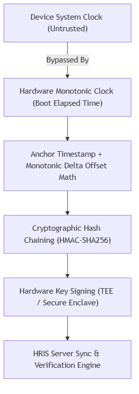

# 🏗️ Human Resource Information System (HRIS) for Arcenas Development Corporation

> An enterprise-grade, offline-first HRIS designed specifically for construction site environments. Features a web administrative dashboard for payroll and HR management, combined with a React Native mobile application for site foremen to rapidly log crew attendance offline while preventing timestamp tampering via hardware and cryptographic validation.

---

## 📌 Executive Summary

Construction firms struggle to track daily worker attendance across temporary and remote project sites where cellular signal is non-existent and fixed biometric scanners are impractical. Relying on paper logbooks leads to delayed reporting, payroll errors, and high susceptibility to time-tampering fraud.

This system solves these issues through a dual-component architecture:
1. **Central Web HRIS (Laravel + React.js + MySQL):** Manages employee records, payroll, leave requests, and supervisor audit workflows.
2. **Offline-First Mobile App (React Native + SQLite/SQLCipher):** Allows site foremen to log crew attendance in seconds using a digital checklist. Stores encrypted data locally at remote sites and auto-syncs with the HRIS when online.
3. **Cryptographic Validation Engine:** Prevents workers or foremen from spoofing clock-in times by manually altering mobile device clocks.

---

## 👥 Target Users & System Roles

| Role | Primary Interface | Key Responsibilities |
| :--- | :--- | :--- |
| **Site Foremen** | Mobile App (React Native) | Rapid offline crew attendance logging via digital checklists; reporting site delays. |
| **Site Engineers** | Web Portal & Mobile App | Reviewing flagged attendance overrides, approving crew recovery logs, supervising site operations. |
| **HR / Payroll Officers** | Web Portal (React.js) | Managing worker registries, skill certifications, processing payroll, reviewing compliance logs. |
| **Company Executives** | Web Portal (React.js) | Viewing workforce analytics, site labor cost breakdowns, and attendance metrics. |

---

## 🛠️ Technology Stack

```
+-----------------------------------------------------------------------------------+
|                                 SYSTEM TECH STACK                                 |
+----------------------------------------+------------------------------------------+
| Web Frontend (Admin & HR)              | React.js, TailwindCSS, Chart.js          |
| Web Backend (REST API)                 | Laravel (PHP 8.x)                        |
| Server Database                        | MySQL 8.0                                |
| Mobile Application (Android/iOS)       | React Native (Cross-Platform)            |
| Mobile Local Storage                   | SQLite with SQLCipher (AES-256 Encryption)|
| Mobile Hardware Integration            | Android Keystore / iOS Secure Enclave    |
| Cryptography Engine                    | HMAC-SHA256, ECDSA P-256, Monotonic Clock|
+----------------------------------------+------------------------------------------+
```

---

## 🔐 Cryptographic Time-Tampering Validation Engine

### ⚠️ The Problem: Untrusted Device Clocks
In an offline mobile environment, standard JavaScript time calls (e.g., `Date.now()`) query the mobile OS clock. A foreman or worker can navigate to phone settings (`Settings -> System -> Date & Time`) and set the clock backward to fake punctual clock-ins. Offline devices cannot contact NTP servers to verify the true time.

---

### 🛡️ Cryptographic & Hardware Defense Protocol Architecture



#### Layer 1: Monotonic Hardware Clocks (`elapsedRealtime`)
* The app queries the hardware monotonic clock (e.g., `SystemClock.elapsedRealtime()` on Android, `mach_continuous_time()` on iOS).
* **Properties:** Counts milliseconds elapsed since device boot. **CANNOT** be modified by user settings, manual date changes, or time zone shifts.

#### Layer 2: Anchor Timestamping & Relative Time Math
* When online, the app saves a **Server Time Anchor** ($T_{server}$) alongside the monotonic tick count ($M_{anchor}$).
* When offline, the true attendance event time ($T_{event}$) is computed purely via relative delta math:

$$\text{T}_{event} = \text{T}_{anchor} + (\text{M}_{event} - \text{M}_{anchor})$$

* Manual changes to the phone's wall-clock display have zero effect on $(\text{M}_{event} - \text{M}_{anchor})$.

#### Layer 3: Cryptographic Hash Chaining (HMAC-SHA256)
Every attendance log is linked to the previous log in an append-only cryptographic ledger:

$$\text{H}_n = \text{HMAC-SHA256}(K_{device}, E_n \parallel \text{H}_{n-1} \parallel \text{M}_{event})$$

* **Impact:** Modifying a local database entry or inserting a retroactively fake log breaks the hash sequence ($\text{H}_n$), causing immediate server verification failure upon sync.

#### Layer 4: Hardware Security Module Signing (TEE / Secure Enclave)
* Asymmetric ECDSA P-256 key pairs are generated inside the phone's hardware security chip (Android Keystore TEE / iOS Secure Enclave).
* The private key $K_{private}$ can never be extracted by software or root access.
* Batched attendance payloads are digitally signed inside the enclave before transmission:

$$\text{Signature} = \text{Sign}_{ECDSA}(K_{private}, \text{BatchPayload} \parallel \text{H}_{final})$$

---

## ⚡ Operational Edge Case Handling & Business Logic

### 1. Late Foreman Scenario ("Default Shift Start" Rule)
* **Problem:** Workers arrive at 7:00 AM, but the foreman carrying the mobile app arrives late at 8:15 AM.
* **Business Rule:** Laborers must not be penalized for foreman delays.
* **System Logic:**
  1. When the foreman opens the checklist at 8:15 AM, **all present workers are checked as "Present at 7:00 AM" by default**.
  2. The foreman only adjusts workers who were individually late (e.g., arrived at 7:45 AM).
  3. The system logs two timestamps: `PhysicalSubmissionTime` (8:15 AM) and `ClaimedWorkerTime` (7:00 AM), flagging the record as `FOREMAN_LATE_OVERRIDE`.
  4. The audit flag alerts the Site Engineer and HR to review foreman punctuality without holding up worker payroll.

### 2. No Guard / Remote Site Scenario
* **Problem:** Remote construction sites lack fixed guards or entrance turnstiles.
* **System Logic:**
  * Uses the **Default Shift Start** policy backed by **Offline GPS Geofencing**. Workers with smartphones can self-clock-in within the site radius ($Lat, Long$).
  * Any attendance disputes are routed to the Site Engineer for one-click verification on the web dashboard.

### 3. Completely Absent Foreman Scenario
* **Problem:** The foreman is sick or absent for the entire day.
* **System Logic (3-Tiered Recovery):**
  1. **1-Click Web Delegation:** HR or the Site Engineer re-assigns the crew to a Stand-in Foreman or Lead Man via the Web HRIS. The crew instantly appears on the stand-in's mobile app.
  2. **Site Engineer Mobile Logging:** Site Engineers can switch the mobile app to "Emergency Supervisor Mode" and log attendance directly.
  3. **Retroactive Crew Recovery Workflow:** If no app was present all day, the system generates a draft recovery batch defaulting regular crew members to standard shift hours, requiring mandatory Site Engineer digital sign-off.

---

## 📊 Vulnerability & Threat Mitigation Matrix

| Threat Vector | Standard Mobile App | HRIS Cryptographic Architecture |
| :--- | :--- | :--- |
| **Manual System Clock Rollback** | Falsified attendance timestamp accepted | Monotonic clock delta math $(\text{M}_{event} - \text{M}_{anchor})$ ignores OS time |
| **Direct SQLite Database Modification** | Attendance data mutated silently | HMAC Hash Chain breaks if any historical entry is altered |
| **Fake API Request Injection** | Attacker spams fake attendance endpoints | Hardware TEE ECDSA signatures verify physical device origin |
| **Foreman Covering Up Late Arrival** | Foreman alters worker time unmonitored | Monotonic submission time logged alongside claimed time with `FOREMAN_LATE` flag |
| **Absent Foreman Leaving Crew Unrecorded** | Zero records logged; payroll disrupted | 1-Click Web Crew Re-assignment & Retroactive Crew Recovery Workflow |

---

## 🛡️ Capstone Defense Arsenal (Quick Reference)

If the capstone evaluation panel asks:

1. **"How do you measure or record attendance offline?"**
   > *"Foremen use an offline-first React Native mobile app with a digital checklist. Data is stored locally in an AES-256 encrypted SQLite database and automatically syncs to the Laravel backend when online."*

2. **"What if the foreman changes the phone clock to cheat attendance?"**
   > *"The app completely ignores wall-clock time (`Date.now()`). It calculates offline timestamps using the device's hardware monotonic clock (`elapsedRealtime`), combined with HMAC-SHA256 hash chaining and TEE hardware digital signatures."*

3. **"What if the foreman arrives late or is absent?"**
   > *"If late, our system applies the Default Shift Start rule crediting workers from 7:00 AM while flagging a `FOREMAN_LATE_OVERRIDE` audit log for Site Engineer review. If absent, HR re-assigns the crew to a stand-in foreman via the web portal or uses our Retroactive Crew Recovery Workflow."*

---

## 📜 Project Proponents & Team Roles

* **Jay Mark A. Reños** — Project Manager
* **Liza Mae C. Sugala** — Systems Analyst
* **Rusel R. Portes** — Lead Developer / Programmer
* **Efren S. Cabudbud Jr.** — Database & QA Lead
* **Carl Vey Sente** — UI/UX
* **Rayla G. Lanaza** — UI/UX & Documentation Lead

**Project Title Reviewer:** Clark Kevin V. Villamor

---

## 🔀 Git Collaboration Workflow

> Follow this guide every time you work on the repository. **Never push directly to `main`.**

### 1. Clone the Repository (first time)

```bash
git clone https://github.com/ruselportes/HRIS.git
cd HRIS
```

### 2. Create Your Own Branch

Always work on a separate branch, never directly on `main`.

```bash
git checkout main
git pull origin main          # make sure main is up to date
git checkout -b feature/payroll  # or fix/<name>, docs/<name>
```

Branch naming conventions:

| Branch type | Prefix | Example |
| :--- | :--- | :--- |
| New feature | `feature/` | `feature/payroll-module` |
| Bug fix | `fix/` | `fix/sync-timestamp-bug` |
| Documentation | `docs/` | `docs/srs-update` |
| Database / schema | `db/` | `db/attendance-schema-v2` |

### 3. Pull Latest Changes Often

Before starting and before pushing, always pull the latest changes:

```bash
git pull origin main
```

If you are on a feature branch and `main` moved forward, rebase your branch on top of it:

```bash
git pull --rebase origin main
```

### 4. Commit Frequently with Clear Messages

```bash
git status                # see what changed
git add <file-or-folder>  # stage specific files
git commit -m "Add payroll summary API endpoint"
```

Good commit message style:

```
<verb> <short summary>
```

Examples:
- `Add attendance sync endpoint`
- `Fix HMAC hash chain validation bug`
- `Update SRS with leave approval flow`

### 5. Push Your Branch and Open a Pull Request

```bash
git push -u origin feature/payroll
```

Then on GitHub, open a **Pull Request (PR)** from your branch into `main`:

1. Go to the repository on GitHub → **Pull Requests** → **New pull request**.
2. Base: `main` ← Compare: `your-branch`.
3. Add a title and short description of what you changed.
4. Request a review from **Rusel R. Portes** (Lead Developer).
5. Wait for review and approval before merging.

### 6. Keep Your Branch Up to Date (if requested to fix)

```bash
git pull --rebase origin main   # update with latest main
git add .
git commit -m "Address review feedback"
git push                        # force not needed after rebase + normal push
```

### 7. Merging Rules

- **Never** push directly to `main` or `master`.
- Merge only through a reviewed Pull Request.
- `main` must always stay in a working, runnable state.
- Conflicts: `git pull --rebase origin main`, resolve conflicts in your editor, then `git add . && git rebase --continue`.

### 8. Quick Reference

| Task | Command |
| :--- | :--- |
| See current branch | `git branch` |
| Switch branch | `git checkout <branch>` |
| List all branches | `git branch -a` |
| Discard local changes (danger) | `git checkout -- <file>` |
| See who changed what | `git log --oneline` |
| Delete local branch | `git branch -d <branch>` |
