# Software Design Description (SDD)

*for*

**Human Resource Information System (HRIS)**
**for Arcenas Development Corporation**

Document Version: 1.0
Date: September 3, 2026

Prepared By: Jay Mark A. Reños, Liza Mae C. Sugala, Rusel R. Portes, Efren S. Cabudbud Jr., CarlVey Sente, Rayla G. Lanaza

Technical Adviser: Eric Bulala

Subject Adviser: Engr. Clark Kevin V. Villamor — Head, College of Computer Studies

---

## List of Figures

| Figure | Description |
|---|---|
| 1.0 | Employee & Workforce Management Class Diagram |
| 2.0 | Crew Assignment & Site Deployment Class Diagram |
| 3.0 | Offline Attendance Checklist Class Diagram |
| 4.0 | Cryptographic Attendance Integrity Class Diagram |
| 5.0 | Background Sync Engine Class Diagram |
| 6.0 | Payroll Processing Class Diagram |
| 7.0 | Leave & Overtime Class Diagram |
| 8.0 | Audit & Analytics Class Diagram |
| 9.0 | Entity-Relationship Diagram |
| 10.0 | Login & RBAC Authentication Sequence Diagram |
| 11.0 | Offline Attendance Logging Sequence Diagram |
| 12.0 | Cryptographic Signing Sequence Diagram |
| 13.0 | Background Sync Sequence Diagram |
| 14.0 | Payroll Computation Sequence Diagram |
| 15.0 | Leave & Overtime Approval Sequence Diagram |
| 16.0 | Web Portal – Login Interface |
| 17.0 | Web Portal – Dashboard Interface |
| 18.0 | Web Portal – Employee Management Interface |
| 19.0 | Web Portal – Crew Assignment Interface |
| 20.0 | Web Portal – Attendance Monitoring Interface |
| 21.0 | Web Portal – Payroll Interface |
| 22.0 | Web Portal – Leave & Overtime Interface |
| 23.0 | Web Portal – Executive Analytics Dashboard |
| 24.0 | Mobile App – Login Interface |
| 25.0 | Mobile App – Attendance Checklist Interface |
| 26.0 | Mobile App – Sync Status Interface |

## List of Tables

| Table | Description |
|---|---|
| 1.0 | Definitions, Acronyms, and Abbreviations |
| 2.0 | Employee |
| 3.0 | Role |
| 4.0 | Site |
| 5.0 | Crew |
| 6.0 | Crew Assignment |
| 7.0 | Attendance |
| 8.0 | Attendance Sync Queue |
| 9.0 | Crypto Signature Ledger |
| 10.0 | Payroll |
| 11.0 | Payroll Detail |
| 12.0 | Leave Request |
| 13.0 | Overtime Request |
| 14.0 | Audit Log |

---

## 1. Introduction

### 1.1. Purpose

This document presents the Software Design Description (SDD) of the Human Resource Information System (HRIS) for Arcenas Development Corporation. It describes the system's software architecture, data design, detailed design, and human interface design, providing the development team with a technical blueprint for implementing the web portal, the offline-capable mobile attendance application, and the cryptographic attendance integrity engine defined in the Software Requirements Specification (SRS).

### 1.2. Scope

This document describes the design of the HRIS, covering nine core modules: (1) Employee and Workforce Management, (2) Crew Assignment and Site Deployment, (3) Offline-Capable Mobile Attendance Checklist, (4) Cryptographic Attendance Integrity Engine, (5) Automated Background Sync Engine, (6) Foreman Edge Case Handling System, (7) Philippine Labor Code Payroll Engine, (8) Leave and Overtime Filing Workflow, and (9) Executive Compliance and Analytics Dashboard. It explains how the Laravel API, React.js web portal, React Native mobile application, and MySQL database interact to allow HR Personnel, Site Engineers, Executives, and Site Foremen to manage attendance, payroll, and workforce data reliably, including at remote construction sites without internet connectivity.

### 1.3. Definitions, Acronyms, and Abbreviations

| Term | Definition |
|---|---|
| HRIS | Human Resource Information System — the central web-based system for HR and payroll management. |
| SPMP | Software Project Management Plan. |
| SRS | Software Requirements Specification. |
| SDD | Software Design Description — this document. |
| STD | Software Test Document. |
| Mobile App | The React Native mobile attendance application used by Site Foremen. |
| Offline-Capable | The mobile app's ability to function and record attendance without internet connectivity, storing data locally until sync. |
| TEE | Trusted Execution Environment — hardware security chip in Android devices (Android Keystore) used for cryptographic key generation that cannot be extracted by software. |
| Secure Enclave | Apple's equivalent of TEE on iOS devices. |
| ECDSA | Elliptic Curve Digital Signature Algorithm — used to sign attendance batch payloads inside the device TEE/Secure Enclave. |
| HMAC-SHA256 | Hash-based Message Authentication Code using SHA-256 — creates the cryptographic hash chain linking attendance records. |
| Monotonic Clock | A hardware clock (elapsedRealtime on Android, mach_continuous_time on iOS) that counts time since device boot and cannot be altered by manual clock changes. |
| SQLCipher | Open-source SQLite extension providing AES-256 transparent database encryption for local mobile storage. |
| RBAC | Role-Based Access Control — restricts system access by user role (Admin, HR, Engineer, Foreman). |
| Foreman Late Override | System flag applied when a foreman logs attendance after shift start time, crediting workers from standard shift start. |
| Retroactive Recovery | Workflow allowing Site Engineers to review and sign off on crew attendance for days where no logging occurred. |
| Background Sync | Automatic transmission of queued offline attendance data to the central HRIS once mobile internet connectivity is detected. |

*Table 1.0 Definitions, Acronyms, and Abbreviations*

### 1.4. References

[1] IEEE Std 1058-1998: Standard for Software Project Management Plans.

[2] Republic Act 442: Philippine Labor Code — Articles 83, 86, 87, 93, and 94.

[3] Arcenas Development Corporation System Requirements and Business Rules.

[4] React Native Documentation — reactnative.dev

[5] Laravel Documentation — laravel.com/docs

[6] Android Keystore System — developer.android.com/training/articles/keystore

[7] SQLCipher Documentation — zetetic.net/sqlcipher

[8] Software Project Management Plan (SPMP) for HRIS, Arcenas Development Corporation, v1.0, 2026.

## 2. System Architecture

The HRIS follows a layered client-server architecture composed of a React Native mobile client, a React.js web client, a Laravel REST API layer, and a MySQL 8.0 relational database. This section presents the class diagrams for each major module of the system.

### 2.1. Class Diagram

#### 2.1.1 Employee & Workforce Management

Represents the classes that manage employee profiles, trade skills, certifications, daily pay rates, and employment status. Core classes include Employee and Role, which are used across the web portal by HR Personnel.

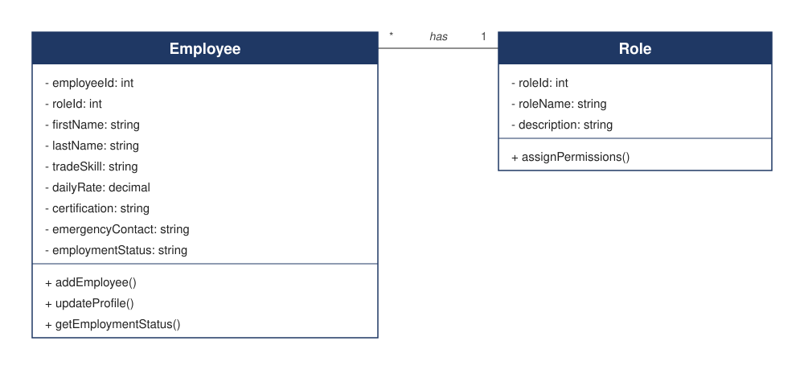

*Figure 1.0 Employee & Workforce Management Class Diagram*

> **Note:** The original figure predated the finalized data dictionary — it showed `certification` split out into a separate `Certification` class/table and omitted `emergencyContact` from `Employee`. The actual schema (§3.1.1, and `backend/database/migrations/..._create_employees_table.php`) stores both `certification` and `emergency_contact` as columns directly on `tbl_employee` — no separate certifications table. Per this document's own convention, **the data dictionary wins**.
>
> The diagram above is the corrected version: `Certification` removed, `certification` and `emergencyContact` restored as `Employee` attributes, and `employeeCode`/`email`/`siteId` added to reflect the Phase 2 auth/site-link additions. Following this document's ERD convention (§3.2), it deliberately still omits `password` (sensitive) and the long tail of HR-profile-only fields (`dateOfBirth`, `mobile`, `civilStatus`, `dependents`, `address`, `bloodType`, `tin`, `sss`, `philhealth`, `pagIbig`, `dateHired`, `costCentre`) that don't participate in relationships or business logic — see §3.1.1 for the exhaustive field list. The original, uncorrected PNG is kept at `assets/sdd-fig-1-0-employee-workforce-management-class-diagram.png` for reference.
>
> This corrected diagram is not in `3.-Software-Design-Description-Template.docx`, which still shows the original `Employee`/`Role`/`Certification` layout with no caveat.

#### 2.1.2 Crew Assignment & Site Deployment

Represents how Site Engineers organize workers into crews, assign them to project sites, and designate responsible foremen. Core classes include Site, Crew, and CrewAssignment.

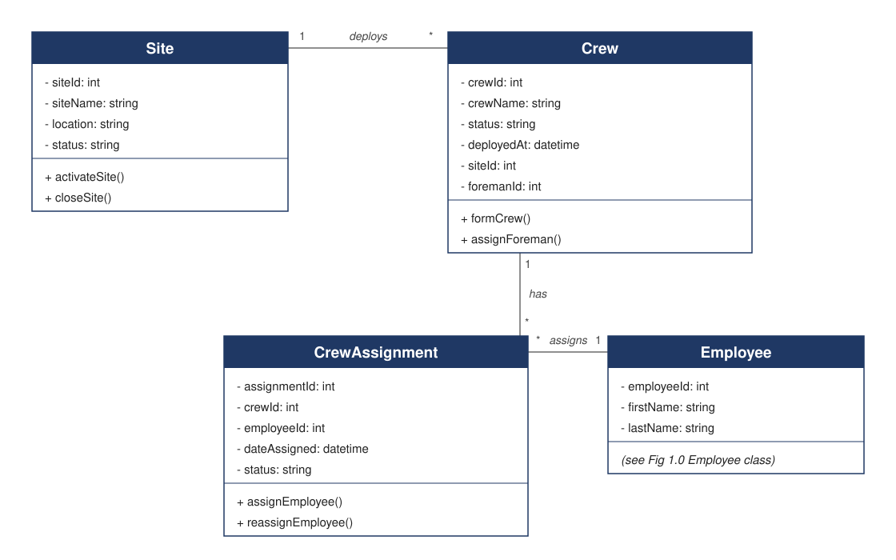

*Figure 2.0 Crew Assignment & Site Deployment Class Diagram*

> **Note:** The original figure predated the finalized data dictionary — its `Crew` class omitted `status` and `deployedAt`. The actual schema (§3.1.4, and `backend/database/migrations/0003_01_01_000000_add_deployment_state_to_crews_table.php`) carries both — **the data dictionary wins** per this document's own convention.
>
> The diagram above is the corrected version: `status` and `deployedAt` added to `Crew` to reflect the Phase 3 deployment-state addition (§3.1.4); `Site`, `CrewAssignment`, and `Employee` are unchanged (`Employee` is a stub here — see Figure 1.0 for its corrected attribute list). The original, uncorrected PNG is kept at `assets/sdd-fig-2-0-crew-assignment-site-deployment-class-diagram.png` for reference.
>
> This corrected diagram was produced from the markdown data dictionary only — **it is not in `3.-Software-Design-Description-Template.docx`**, which still shows the pre-Phase-3 `Crew` class with no `status`/`deployedAt` and carries no note calling that out. Treat the docx as behind this document until it's regenerated from §3.1.

#### 2.1.3 Offline Attendance Checklist

Represents the mobile-side classes that allow a Site Foreman to record crew attendance through a digital tap-based checklist while offline. Core classes include AttendanceEntry, LocalAttendanceStore, and ChecklistController.

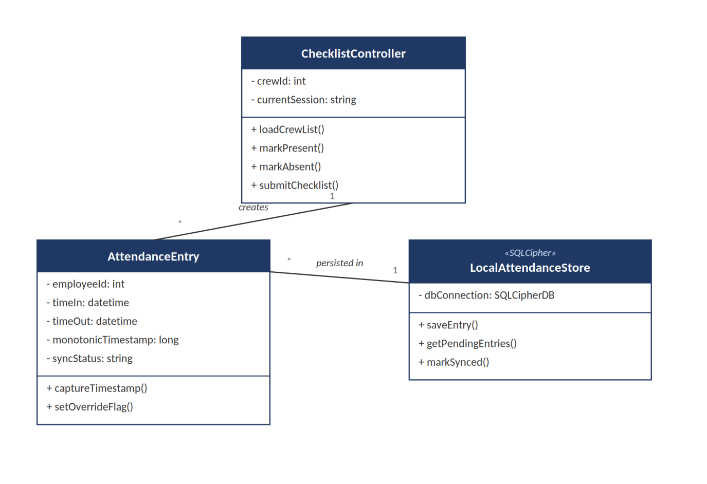

*Figure 3.0 Offline Attendance Checklist Class Diagram*

#### 2.1.4 Cryptographic Attendance Integrity

Represents the 4-layer security engine that protects attendance timestamps from manipulation: MonotonicClockService, HashChainBuilder (HMAC-SHA256), TEESigner (ECDSA P-256), and SignatureVerifier.

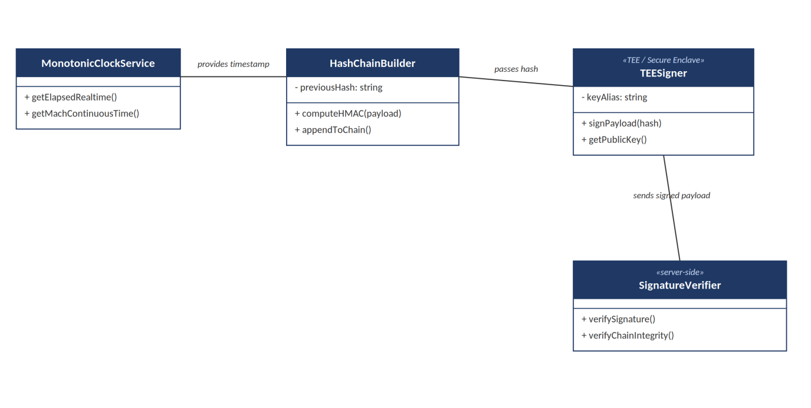

*Figure 4.0 Cryptographic Attendance Integrity Class Diagram*

#### 2.1.5 Background Sync Engine

Represents the classes responsible for detecting connectivity and transmitting queued offline attendance records to the central server. Core classes include SyncQueueManager, ConnectivityMonitor, and SyncApiClient.

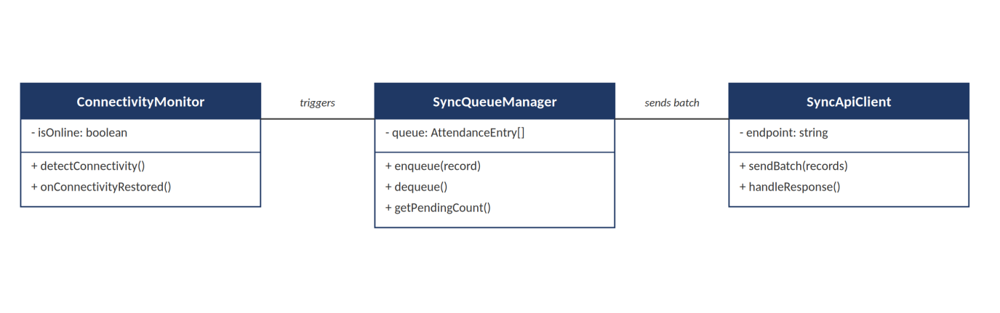

*Figure 5.0 Background Sync Engine Class Diagram*

#### 2.1.6 Payroll Processing

Represents the classes that compute gross and net pay in compliance with the Philippine Labor Code. Core classes include PayrollEngine, PayrollDetail, and RateCalculator (Regular, OT 1.25x, Night Diff 1.10x, Rest Day 1.30x, Holiday 2.0x).

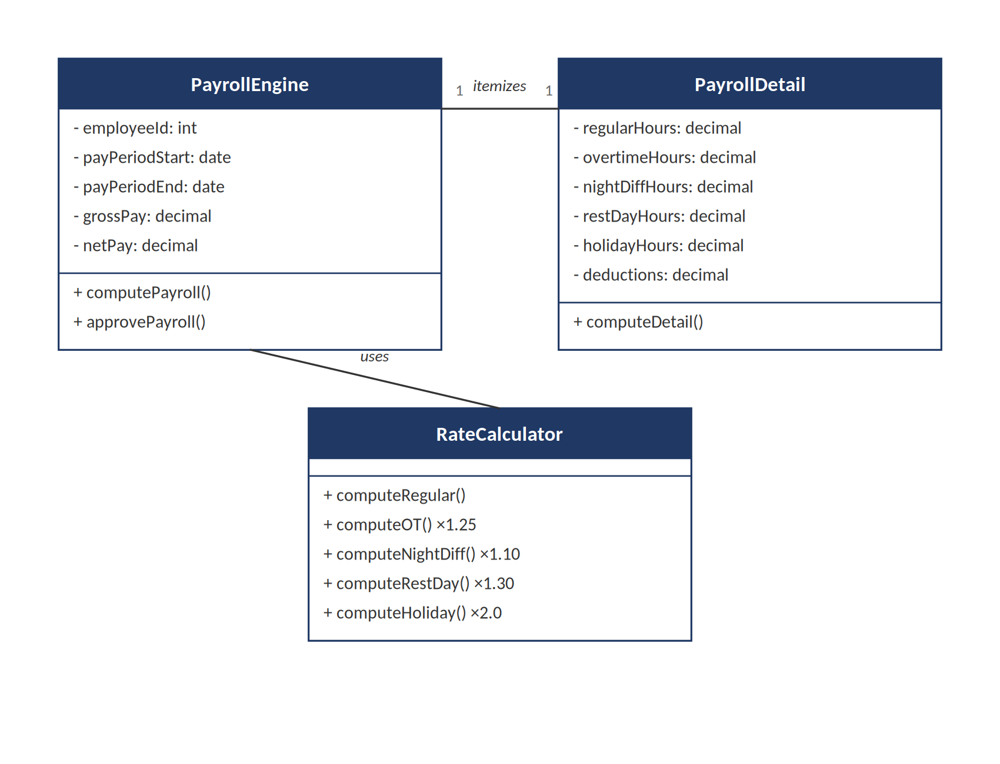

*Figure 6.0 Payroll Processing Class Diagram*

#### 2.1.7 Leave & Overtime

Represents the classes handling leave and overtime filing and the multi-tier approval workflow. Core classes include LeaveRequest, OvertimeRequest, and ApprovalWorkflow.

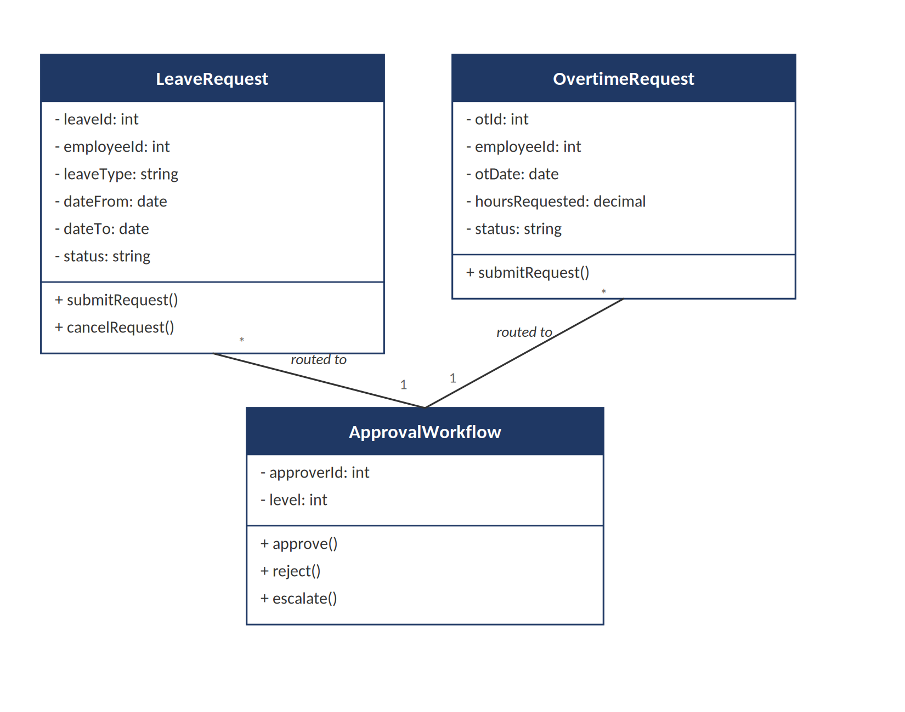

*Figure 7.0 Leave & Overtime Class Diagram*

#### 2.1.8 Audit & Analytics

Represents the classes that log override events and generate executive-level dashboards for labor cost analytics, punctuality tracking, and audit review. Core classes include AuditLog, AnalyticsAggregator, and DashboardService.

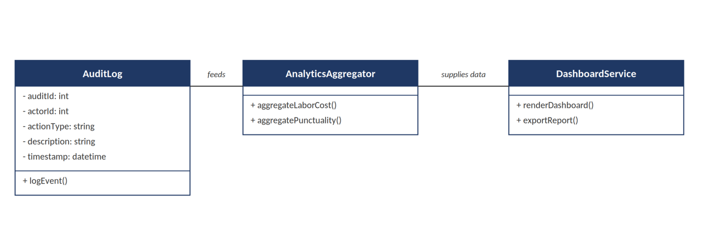

*Figure 8.0 Audit & Analytics Class Diagram*

## 3. Data Design

### 3.1. Data Description

This section describes the database tables used in the Human Resource Information System (HRIS). Each table includes its purpose, key relationships, and field-level structure.

#### 3.1.1 Employee

Table Name: tbl_employee

Table Description: Table where employee profile, trade skill, pay rate, and login credential information is stored.

Primary Key: employee_id

Foreign Key: role_id, site_id

| Fieldname | Data Type | Length | Description |
|---|---|---|---|
| employee_id | int | 11 | Unique identifier for the employee |
| employee_code | varchar | 255 | ADC-NNNN identifier; used alongside email as a login identifier (Phase 2) |
| email | varchar | 255 | Login identifier; nullable — most field workers have no company email (Phase 2) |
| password | varchar | 255 | Hashed login secret; null means the account cannot sign in (Worker/Operator records never get one) (Phase 2) |
| first_name | varchar | 100 | Employee's first name |
| middle_name | varchar | 255 | Employee's middle name (nullable) |
| last_name | varchar | 100 | Employee's last name |
| trade_skill | varchar | 100 | Employee's construction trade skill (e.g., Mason, Electrician) |
| daily_rate | decimal | 10,2 | Employee's daily pay rate |
| certification | json | - | Field that stores skill certification details (array of certification records) |
| emergency_contact | json | - | Emergency contact name and number (structured object) |
| employment_status | varchar | 50 | Probationary, Active, On Leave, or Terminated |
| date_of_birth | date | - | Employee's date of birth |
| mobile | varchar | 255 | Employee's mobile number |
| civil_status | varchar | 255 | Employee's civil status |
| dependents | tinyint | 3 | Number of declared dependents |
| address | varchar | 255 | Employee's home address |
| blood_type | varchar | 255 | Employee's blood type |
| tin | varchar | 255 | Tax Identification Number |
| sss | varchar | 255 | Social Security System number |
| philhealth | varchar | 255 | PhilHealth number |
| pag_ibig | varchar | 255 | Pag-IBIG (HDMF) number |
| date_hired | date | - | Date the employee was hired |
| cost_centre | varchar | 255 | Cost centre code the employee's pay is charged to |
| role_id | int | 11 | Field that links to the employee's system role |
| site_id | int | 11 | Field that links to the employee's primary/current project site (nullable; denormalized ahead of crew assignment being authoritative — see `backend/database/migrations/0002_01_01_000100_add_site_to_employees_table.php`) |

*Table 2.0 Employee*

> **Phase 2/3 note:** `employee_code`, `email`, `password`, and `site_id` were added in Phase 2 (`0002_01_01_000000_add_auth_fields_to_roles_and_employees_table.php`, `0002_01_01_000100_add_site_to_employees_table.php`); `middle_name`, `date_of_birth`, `mobile`, `civil_status`, `dependents`, `address`, `blood_type`, `tin`, `sss`, `philhealth`, `pag_ibig`, `date_hired`, and `cost_centre` were part of the original Phase 1 migration but sourced from the Employee Records prototype rather than the Phase 1 ERD sketch (see `docs/HRIS_ERD_reference.md`). `certification` and `emergency_contact` are stored as `json`, not `varchar` as earlier drafts of this table showed.

#### 3.1.2 Role

Table Name: tbl_role

Table Description: Table where RBAC roles are stored (HR Personnel, Site Foreman, Site Engineer / Construction Manager, System Administrator, Executive, Worker, Operator — per `backend/database/seeders/RoleSeeder.php`; only the first five are login-capable).

Primary Key: role_id

Foreign Key: None

| Fieldname | Data Type | Length | Description |
|---|---|---|---|
| role_id | int | 11 | Unique identifier for the role |
| role_name | varchar | 50 | Display name of the role |
| slug | varchar | 255 | Machine key used by RBAC gate/middleware checks (e.g., `hr`, `foreman`, `engineer`, `worker`, `operator`, `admin`, `executive`) — added Phase 2 |
| description | varchar | 255 | Field that describes the role's access scope |

*Table 3.0 Role*

#### 3.1.3 Site

Table Name: tbl_site

Table Description: Table where construction project site information is stored.

Primary Key: site_id

Foreign Key: None

| Fieldname | Data Type | Length | Description |
|---|---|---|---|
| site_id | int | 11 | Unique identifier for the site |
| site_name | varchar | 150 | Name of the construction site |
| location | varchar | 255 | Physical address or coordinates of the site |
| status | varchar | 50 | Active or Completed |

*Table 4.0 Site*

#### 3.1.4 Crew

Table Name: tbl_crew

Table Description: Table where crew groupings and their assigned site and foreman are stored.

Primary Key: crew_id

Foreign Key: site_id, foreman_id

| Fieldname | Data Type | Length | Description |
|---|---|---|---|
| crew_id | int | 11 | Unique identifier for the crew |
| crew_name | varchar | 100 | Name or code of the crew |
| status | varchar | 20 | Deployment state: `draft` (default), `deployed`, or `archived` (reserved for a future disband flow, Phase 7) — added Phase 3 |
| deployed_at | datetime | - | Date and time the crew was deployed (set by the deploy action); null while in `draft` — added Phase 3 |
| site_id | int | 11 | Field that links to the assigned site |
| foreman_id | int | 11 | Field that links to the employee designated as foreman |

*Table 5.0 Crew*

> **Phase 3 note:** `status` and `deployed_at` were added in `0003_01_01_000000_add_deployment_state_to_crews_table.php` to persist the Crew Builder prototype's Draft / Deploy states; the Phase 1 ERD sketch only had `crew_id, site_id, foreman_id, crew_name`.

#### 3.1.5 Crew Assignment

Table Name: tbl_crew_assignment

Table Description: Table where the deployment of employees to crews is recorded.

Primary Key: assignment_id

Foreign Key: crew_id, employee_id

| Fieldname | Data Type | Length | Description |
|---|---|---|---|
| assignment_id | int | 11 | Unique identifier for the crew assignment |
| crew_id | int | 11 | Field that links to the crew |
| employee_id | int | 11 | Field that links to the assigned employee |
| date_assigned | datetime | - | Date and time the employee was assigned |
| status | varchar | 50 | Active or Reassigned |

*Table 6.0 Crew Assignment*

#### 3.1.6 Attendance

Table Name: tbl_attendance

Table Description: Table where daily attendance records captured on-site or via the mobile app are stored.

Primary Key: attendance_id

Foreign Key: employee_id, crew_id

| Fieldname | Data Type | Length | Description |
|---|---|---|---|
| attendance_id | int | 11 | Unique identifier for the attendance record |
| employee_id | int | 11 | Field that links to the employee |
| crew_id | int | 11 | Field that links to the crew at the time of logging |
| time_in | datetime | - | Recorded time-in |
| time_out | datetime | - | Recorded time-out |
| monotonic_timestamp | bigint | 20 | Hardware monotonic clock value captured at logging time |
| sync_status | varchar | 50 | Pending, Synced, or Failed |
| override_flag | boolean | - | Indicates whether a late foreman override was applied |

*Table 7.0 Attendance*

#### 3.1.7 Attendance Sync Queue

Table Name: tbl_attendance_sync_queue

Table Description: Table where offline attendance records awaiting transmission to the central server are queued.

Primary Key: queue_id

Foreign Key: attendance_id

| Fieldname | Data Type | Length | Description |
|---|---|---|---|
| queue_id | int | 11 | Unique identifier for the queue entry |
| attendance_id | int | 11 | Field that links to the pending attendance record |
| device_id | varchar | 100 | Identifier of the foreman's mobile device |
| queued_at | datetime | - | Date and time the record was queued locally |
| synced_at | datetime | - | Date and time the record was successfully synced |
| sync_status | varchar | 50 | Queued, In Progress, Synced, or Failed |

*Table 8.0 Attendance Sync Queue*

#### 3.1.8 Crypto Signature Ledger

Table Name: tbl_crypto_signature

Table Description: Table where the cryptographic hash chain and digital signatures for each attendance record are stored.

Primary Key: signature_id

Foreign Key: attendance_id

| Fieldname | Data Type | Length | Description |
|---|---|---|---|
| signature_id | int | 11 | Unique identifier for the signature entry |
| attendance_id | int | 11 | Field that links to the signed attendance record |
| hmac_hash | varchar | 255 | HMAC-SHA256 hash of the attendance payload |
| prev_hash | varchar | 255 | Hash of the previous ledger entry, forming the hash chain |
| ecdsa_signature | varchar | 500 | ECDSA P-256 signature generated inside the device TEE/Secure Enclave |
| verified | boolean | - | Indicates whether the server successfully verified the signature |

*Table 9.0 Crypto Signature Ledger*

#### 3.1.9 Payroll

Table Name: tbl_payroll

Table Description: Table where computed payroll summaries per employee per pay period are stored.

Primary Key: payroll_id

Foreign Key: employee_id

| Fieldname | Data Type | Length | Description |
|---|---|---|---|
| payroll_id | int | 11 | Unique identifier for the payroll record |
| employee_id | int | 11 | Field that links to the employee |
| pay_period_start | date | - | Start date of the pay period |
| pay_period_end | date | - | End date of the pay period |
| gross_pay | decimal | 10,2 | Total computed gross pay |
| net_pay | decimal | 10,2 | Total computed net pay after deductions |
| status | varchar | 50 | Draft, Approved, or Released |

*Table 10.0 Payroll*

#### 3.1.10 Payroll Detail

Table Name: tbl_payroll_detail

Table Description: Table where the itemized computation of each payroll record is stored, in compliance with the Philippine Labor Code.

Primary Key: detail_id

Foreign Key: payroll_id

| Fieldname | Data Type | Length | Description |
|---|---|---|---|
| detail_id | int | 11 | Unique identifier for the payroll detail record |
| payroll_id | int | 11 | Field that links to the payroll record |
| regular_hours | decimal | 5,2 | Total regular hours worked |
| overtime_hours | decimal | 5,2 | Total overtime hours (computed at 1.25x) |
| night_diff_hours | decimal | 5,2 | Total night differential hours (computed at 1.10x) |
| rest_day_hours | decimal | 5,2 | Total rest day hours (computed at 1.30x) |
| holiday_hours | decimal | 5,2 | Total holiday hours (computed at 2.0x) |
| deductions | decimal | 10,2 | Total statutory and other deductions |

*Table 11.0 Payroll Detail*

#### 3.1.11 Leave Request

Table Name: tbl_leave_request

Table Description: Table where employee leave applications are stored.

Primary Key: leave_id

Foreign Key: employee_id, approved_by

| Fieldname | Data Type | Length | Description |
|---|---|---|---|
| leave_id | int | 11 | Unique identifier for the leave request |
| employee_id | int | 11 | Field that links to the requesting employee |
| leave_type | varchar | 50 | Sick, Vacation, Emergency, etc. |
| date_from | date | - | Start date of the requested leave |
| date_to | date | - | End date of the requested leave |
| status | varchar | 50 | Pending, Approved, or Rejected |
| approved_by | int | 11 | Field that links to the approving supervisor |

*Table 12.0 Leave Request*

#### 3.1.12 Overtime Request

Table Name: tbl_overtime_request

Table Description: Table where employee overtime applications are stored.

Primary Key: ot_id

Foreign Key: employee_id, approved_by

| Fieldname | Data Type | Length | Description |
|---|---|---|---|
| ot_id | int | 11 | Unique identifier for the overtime request |
| employee_id | int | 11 | Field that links to the requesting employee |
| ot_date | date | - | Date the overtime is requested for |
| hours_requested | decimal | 5,2 | Number of overtime hours requested |
| status | varchar | 50 | Pending, Approved, or Rejected |
| approved_by | int | 11 | Field that links to the approving supervisor |

*Table 13.0 Overtime Request*

#### 3.1.13 Audit Log

Table Name: tbl_audit_log

Table Description: Table where override events and administrative actions are logged for compliance review.

Primary Key: audit_id

Foreign Key: actor_id

| Fieldname | Data Type | Length | Description |
|---|---|---|---|
| audit_id | int | 11 | Unique identifier for the audit entry |
| actor_id | int | 11 | Field that links to the employee who performed the action |
| action_type | varchar | 100 | Late Foreman Override, Crew Re-assignment, Retroactive Recovery, etc. |
| description | varchar | 255 | Details of the logged action |
| timestamp | datetime | - | Date and time the action occurred |

*Table 14.0 Audit Log*

### 3.2. Entity-Relationship Diagram

The Entity-Relationship Diagram below illustrates the relationships among Employee, Role, Site, Crew, Crew Assignment, Attendance, Attendance Sync Queue, Crypto Signature Ledger, Payroll, Payroll Detail, Leave Request, Overtime Request, and Audit Log.

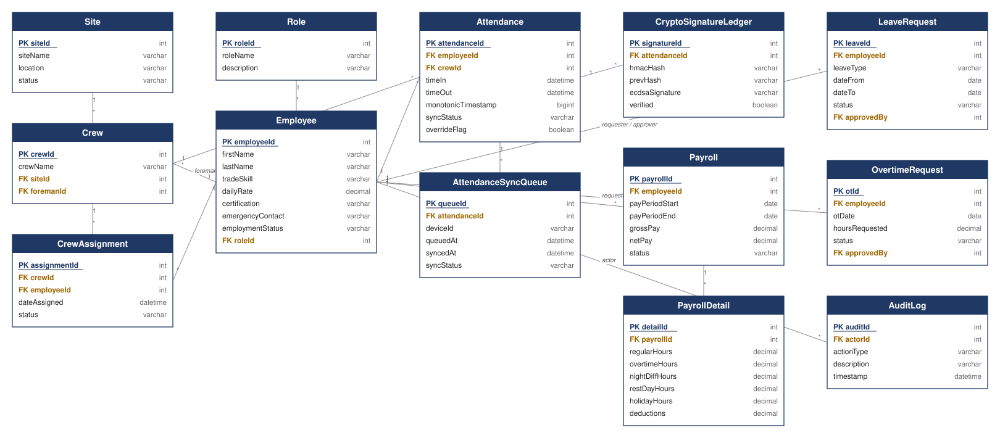

*Figure 9.0 Entity-Relationship Diagram*

> **Note:** The original ERD predated the finalized data dictionary — it omitted both `certification` and `emergencyContact` from `Employee`. See §3.1.1 and `backend/database/migrations/..._create_employees_table.php` for the authoritative field list — **the data dictionary wins** per this document's own convention. The maintained, up-to-date ERD source is `docs/HRIS_ERD.drawio` / `docs/HRIS_ERD_reference.md`.
>
> The diagram above is the corrected version, redrawn directly from the §3.1 data dictionary (all 13 entities, PK/FK preserved). It also adds `Role.slug` and `Crew.status`/`deployedAt` (Phase 2/3 structural additions — see §3.1.2, §3.1.4), and adds `employeeCode`/`email`/`siteId` to `Employee`. Same scoping as `docs/HRIS_ERD_reference.md`: this stays a logical/structural ERD, so `Employee.password` and the non-relational HR-profile fields (`dateOfBirth`, `mobile`, `civilStatus`, etc.) are left out — see §3.1.1 for the exhaustive list. The original, uncorrected PNG is kept at `assets/sdd-fig-9-0-entity-relationship-diagram.png` for reference.
>
> This corrected diagram is not in `3.-Software-Design-Description-Template.docx`, which still shows the original, pre-Phase-2/3 ERD with no caveat.

## 4. Detailed Design

This section presents the sequence diagrams that illustrate the step-by-step interaction between the mobile app, web portal, Laravel API, and MySQL database for the system's core processes.

### 4.1. Login & RBAC Authentication Sequence Diagram

Illustrates how a user (HR Personnel, Site Engineer, Executive, or Site Foreman) logs in and how the Laravel API validates credentials and enforces role-based access control before granting access to the corresponding module.

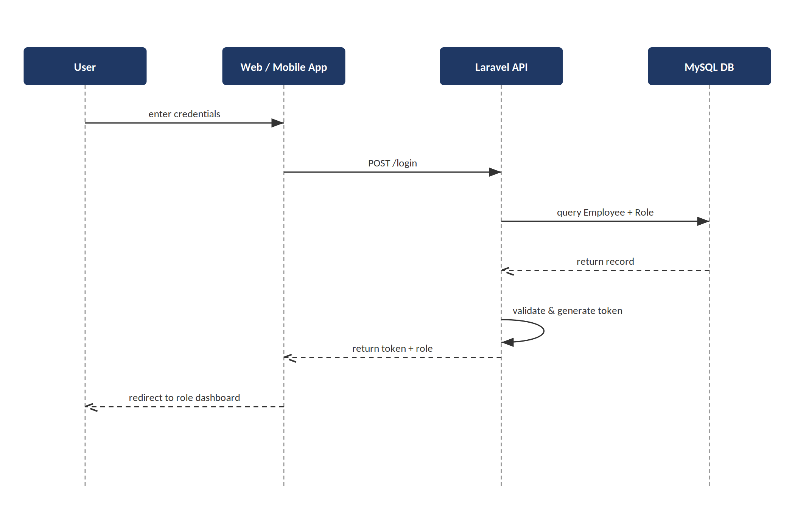

*Figure 10.0 Login & RBAC Authentication Sequence Diagram*

### 4.2. Offline Attendance Logging Sequence Diagram

Illustrates how a Site Foreman records crew attendance through the mobile checklist while offline, and how each entry is captured with a monotonic timestamp and stored locally in the SQLCipher-encrypted database.

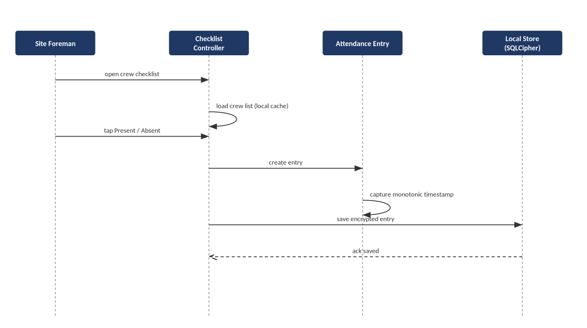

*Figure 11.0 Offline Attendance Logging Sequence Diagram*

### 4.3. Cryptographic Signing Sequence Diagram

Illustrates the 4-layer signing process: monotonic clock capture, HMAC-SHA256 hash chaining, and ECDSA P-256 signing inside the device TEE/Secure Enclave, prior to queuing for sync.

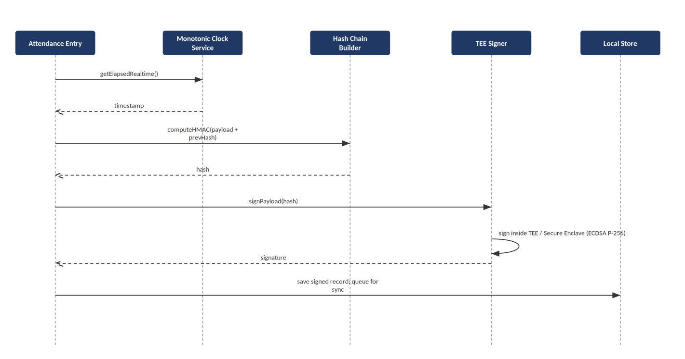

*Figure 12.0 Cryptographic Signing Sequence Diagram*

### 4.4. Background Sync Sequence Diagram

Illustrates how the mobile app detects restored connectivity, transmits queued attendance batches to the Laravel API, and how the server verifies the HMAC hash chain and ECDSA signatures before committing records to MySQL.

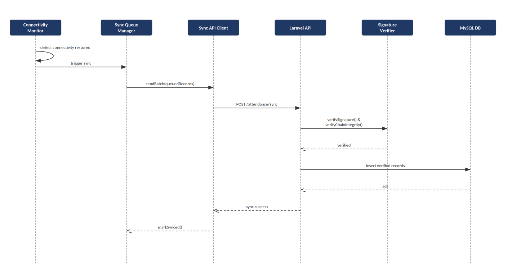

*Figure 13.0 Background Sync Sequence Diagram*

### 4.5. Payroll Computation Sequence Diagram

Illustrates how the Payroll Engine retrieves verified and synced attendance records for a pay period and computes gross and net pay using the applicable Philippine Labor Code rates (Regular, OT 1.25x, Night Diff 1.10x, Rest Day 1.30x, Holiday 2.0x).

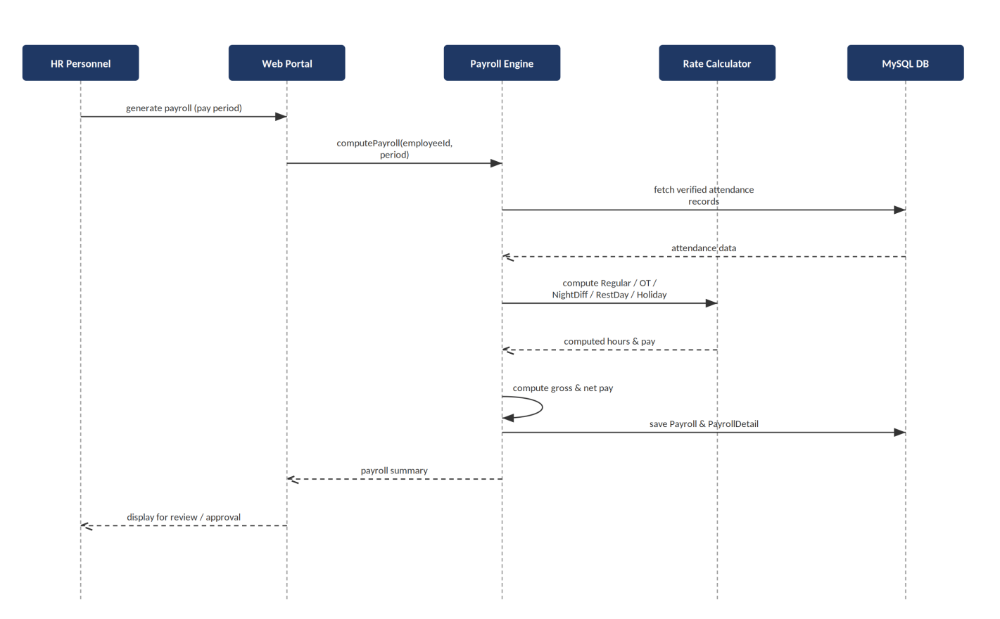

*Figure 14.0 Payroll Computation Sequence Diagram*

### 4.6. Leave & Overtime Approval Sequence Diagram

Illustrates the multi-tier workflow for filing and approving leave and overtime requests, from employee submission through supervisor and HR approval.

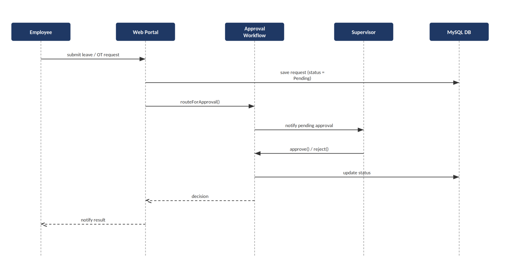

*Figure 15.0 Leave & Overtime Approval Sequence Diagram*

## 5. Human Interface Design

This section presents the module interfaces for both the React.js web portal and the React Native mobile application.

### 5.1. Web Portal Interfaces

#### 5.1.1 Login Interface

Allows Admin, HR Personnel, Site Engineers, and Executives to securely log in to the web portal based on their assigned role.

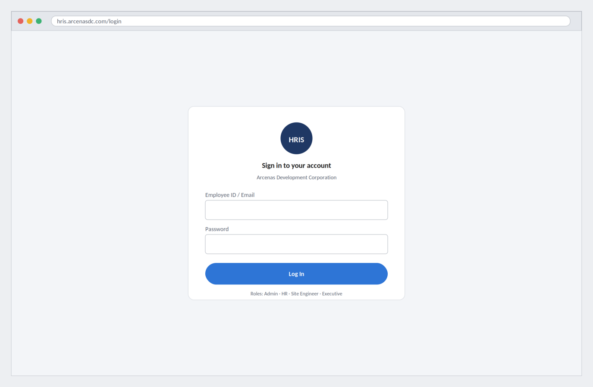

*Figure 16.0 Web Portal – Login Interface*

#### 5.1.2 Dashboard Interface

Displays an overview of active sites, crew headcount, pending approvals, and recent audit events upon login.

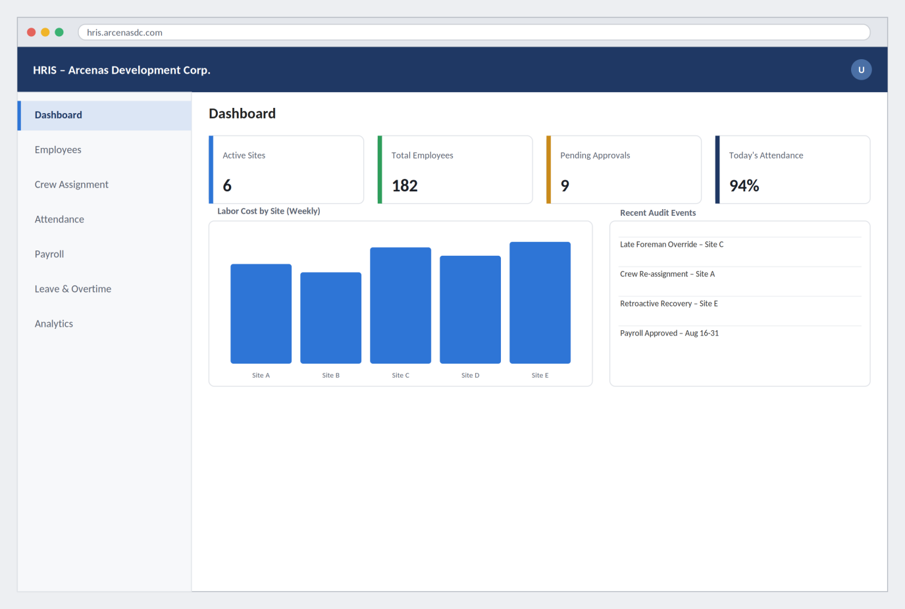

*Figure 17.0 Web Portal – Dashboard Interface*

#### 5.1.3 Employee Management Interface

Allows HR Personnel to add, update, and view employee profiles, trade skills, certifications, daily pay rates, and employment status.

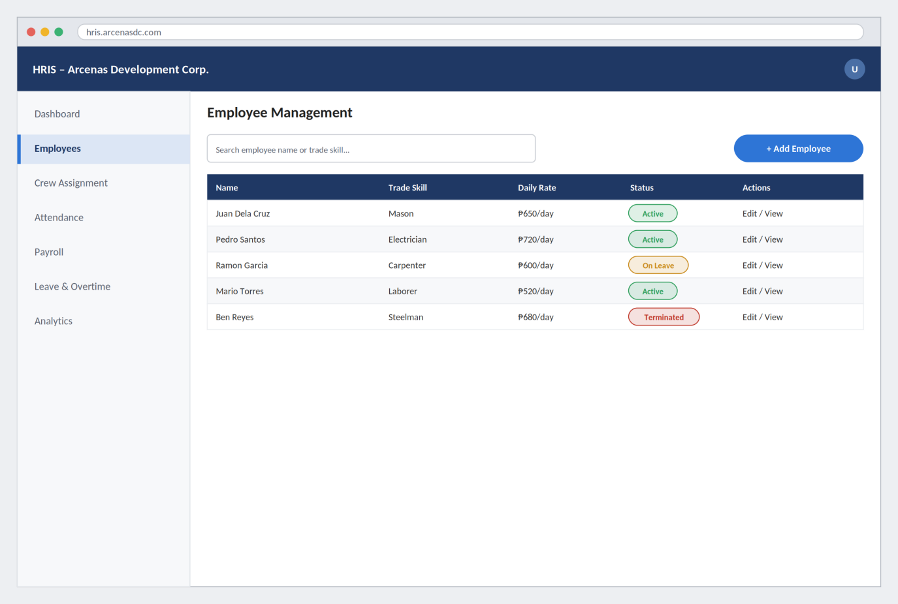

*Figure 18.0 Web Portal – Employee Management Interface*

#### 5.1.4 Crew Assignment Interface

Allows Site Engineers to form crews, assign employees to project sites, and designate responsible foremen.

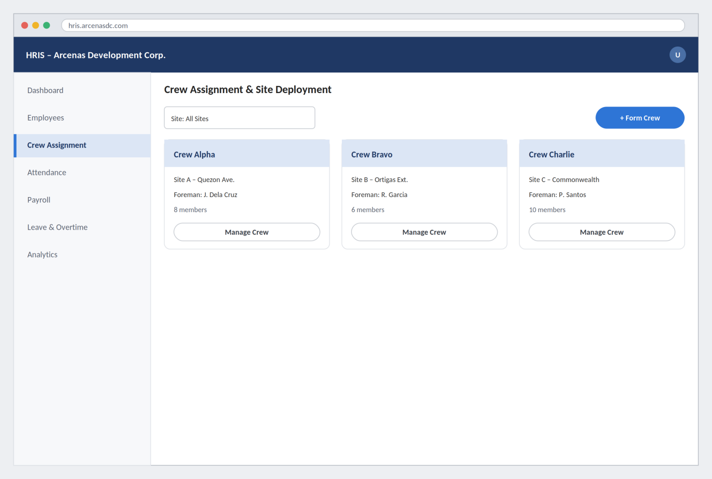

*Figure 19.0 Web Portal – Crew Assignment Interface*

#### 5.1.5 Attendance Monitoring Interface

Displays synced and pending attendance records per site and crew, including flagged late-foreman overrides and retroactive recovery entries.

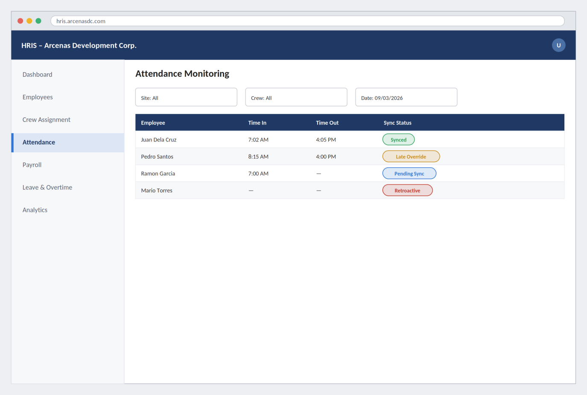

*Figure 20.0 Web Portal – Attendance Monitoring Interface*

#### 5.1.6 Payroll Interface

Allows HR Personnel to generate, review, and approve payroll computations based on verified attendance records for each pay period.

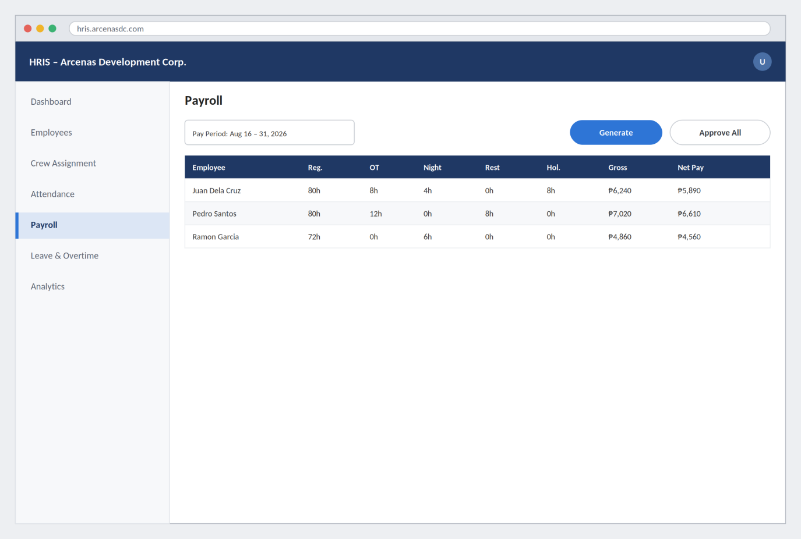

*Figure 21.0 Web Portal – Payroll Interface*

#### 5.1.7 Leave & Overtime Interface

Allows employees and supervisors to file, review, and approve leave and overtime applications.

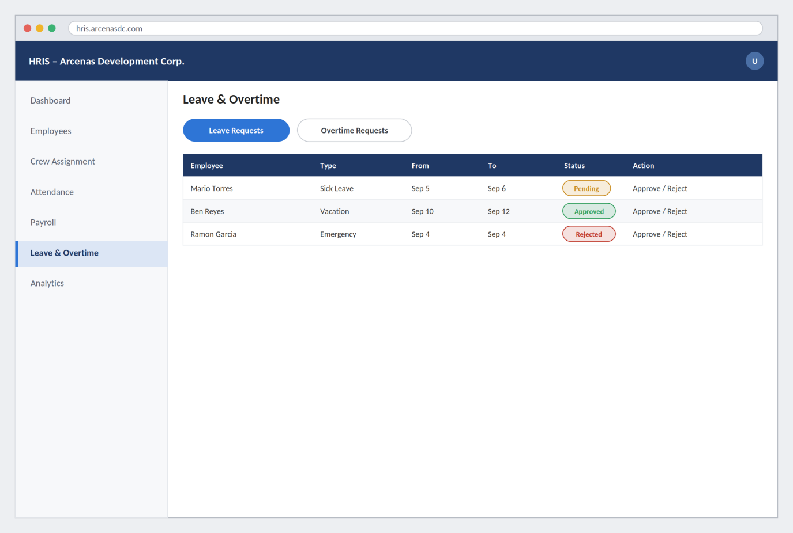

*Figure 22.0 Web Portal – Leave & Overtime Interface*

#### 5.1.8 Executive Analytics Dashboard

Displays real-time labor cost breakdowns, site punctuality rates, and audit override event logs for executives.

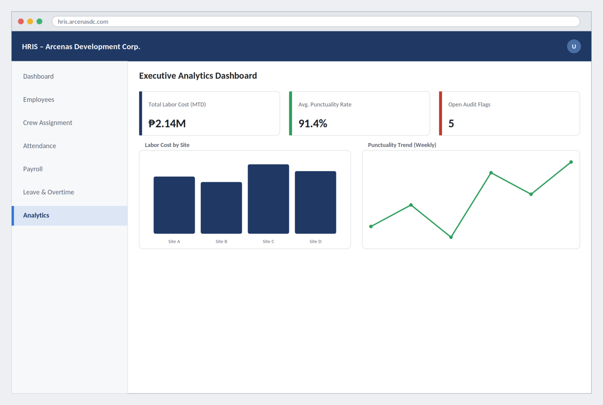

*Figure 23.0 Web Portal – Executive Analytics Dashboard*

### 5.2. Mobile Application Interfaces

#### 5.2.1 Login Interface

Allows a Site Foreman to log in to the mobile app, with credentials cached securely to support authentication while offline.

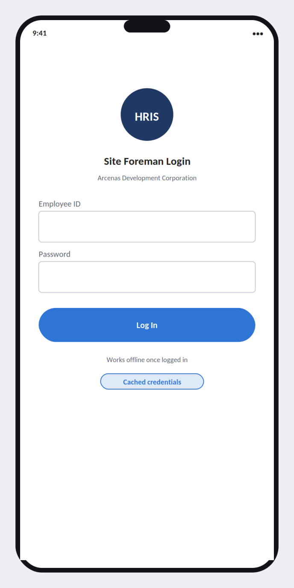

*Figure 24.0 Mobile App – Login Interface*

#### 5.2.2 Attendance Checklist Interface

Allows the Site Foreman to record crew attendance through a digital tap-based checklist, functioning fully without internet connectivity.

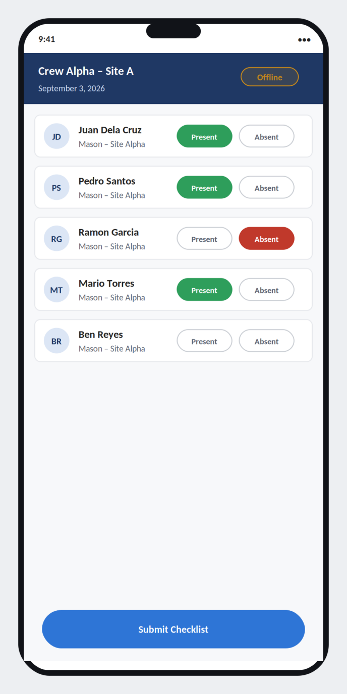

*Figure 25.0 Mobile App – Attendance Checklist Interface*

#### 5.2.3 Sync Status Interface

Displays the status of queued attendance records (Pending, Syncing, Synced, or Failed) and allows the foreman to monitor background sync progress once connectivity is restored.

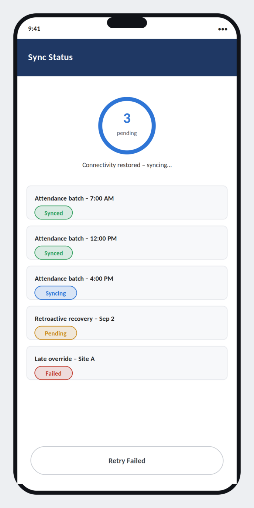

*Figure 26.0 Mobile App – Sync Status Interface*
