# 📄 SOFTWARE REQUIREMENTS & SYSTEM DESIGN SPECIFICATION (SRS / SDD / ERD / STD / TEST PLAN)

## 🏢 Project Title: Human Resource Information System (HRIS) for Arcenas Development Corporation
**Document Version:** 5.0.0  
**Date:** July 24, 2026  
**Target Platform:** Web (React.js + Laravel API + MySQL) & Mobile (React Native + SQLCipher)  
**Proponents:** Jay Mark A. Reños, Liza Mae C. Sugala, Rusel R. Portes, Efren S. Cabudbud Jr., Rayla G. Lanaza  
**Project Title Reviewer:** Engr. Clark Kevin V. Villamor  

---

# 📚 TABLE OF CONTENTS
1. [Software Requirements Specification (SRS)](#1-software-requirements-specification-srs)
2. [1-to-1 Use Case Specifications, High-Res Diagrams & UI Prototypes (UC-01 to UC-15)](#2-1-to-1-use-case-specifications-high-res-diagrams--ui-prototypes-uc-01-to-uc-15)
3. [Software Design Description (SDD)](#3-software-design-description-sdd)
4. [Entity Relationship Diagram (ERD)](#4-entity-relationship-diagram-erd)
5. [Complete Data Dictionary](#5-complete-data-dictionary)
6. [System Process Flowcharts](#6-system-process-flowcharts)
7. [Sequence Diagrams](#7-sequence-diagrams)
8. [State Transition Diagrams (STD)](#8-state-transition-diagrams-std)
9. [Software Testing Plan & Test Cases](#9-software-testing-plan--test-cases)

---

# 1. SOFTWARE REQUIREMENTS SPECIFICATION (SRS)

## 1.1 Purpose & Scope
This document specifies the software requirements and system design for the **Human Resource Information System (HRIS) for Arcenas Development Corporation**. The system bridges field construction attendance with central office payroll processing by utilizing an **offline-first React Native mobile application** for field foremen and a **web-based administrative portal (Laravel + React.js)** for HR and payroll personnel.

## 1.2 Functional Requirements (FR Matrix)

| ID | Module | Description | Related Use Case | Priority |
| :--- | :--- | :--- | :--- | :---: |
| **FR-01** | **User RBAC** | Role-Based Access Control (RBAC) supporting Admin, HR, Engineer, and Foreman roles. | **UC-01** | **High** |
| **FR-02** | **Worker Registry** | Managing worker profiles, skill certifications, daily rate structures, and emergency contacts. | **UC-02** | **High** |
| **FR-03** | **Crew Assignment** | Organizing workers into sub-crews and assigning them to project sites and foremen. | **UC-03** | **High** |
| **FR-04** | **Offline Digital Checklist** | Recording daily attendance via tap-based digital checklists without internet connectivity. | **UC-04** | **High** |
| **FR-05** | **Local Encryption** | Encrypting local SQLite attendance databases using AES-256 (SQLCipher) tied to hardware keys. | **UC-05** | **High** |
| **FR-06** | **Monotonic Time Capture** | Recording hardware monotonic clock counters (`elapsedRealtime`) to prevent clock rollback fraud. | **UC-06** | **High** |
| **FR-07** | **HMAC Hash Chaining** | Linking attendance entries into an append-only cryptographic ledger chain. | **UC-07** | **High** |
| **FR-08** | **Hardware TEE Signing** | Signing sync payloads inside device Hardware Security Modules (Android Keystore / iOS Enclave). | **UC-08** | **High** |
| **FR-09** | **Background Sync Engine** | Transmitting queued offline attendance payloads automatically upon network reconnection. | **UC-09** | **High** |
| **FR-10** | **Late Foreman Override** | Crediting workers for 7:00 AM start when foreman arrives late, while flagging audit records. | **UC-10** | **Medium** |
| **FR-11** | **Crew Re-Assignment** | Re-assigning an absent foreman's crew to a stand-in foreman or lead man in real time. | **UC-11** | **Medium** |
| **FR-12** | **Retroactive Crew Recovery**| Enabling Site Engineers to review and sign off on unrecorded historical crew attendance. | **UC-12** | **Medium** |
| **FR-13** | **Automated Payroll Engine** | Computing Philippine Labor Code pay rates (OT 1.25x, Night Diff 1.10x, Rest Day 1.30x, Holiday 2.0x). | **UC-13** | **High** |
| **FR-14** | **Overtime & Leave Filing** | Submitting and approving overtime and leave applications through multi-tier workflows. | **UC-14** | **Medium** |
| **FR-15** | **Compliance & Analytics** | Displaying executive dashboards for labor costs, attendance punctuality, and audit events. | **UC-15** | **Medium** |

---

# 2. 1-TO-1 USE CASE SPECIFICATIONS, HIGH-RES DIAGRAMS & UI PROTOTYPES (UC-01 TO UC-15)

## 2.1 System Master Use Case Map (Textbook UML Standard)

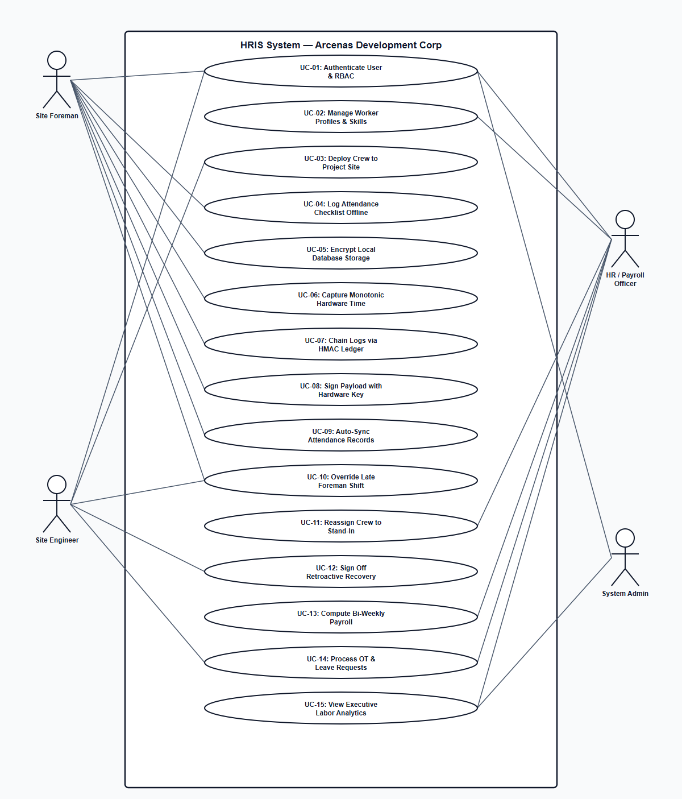

> 🔍 **Vector High-Res Link:** [Open Vector SVG Diagram](diagrams/use_case_diagram.svg)

---

### UC-01: User Authentication & Role-Based Access Control (FR-01)
* **Primary Actor:** System Administrator / All Users
* **Preconditions:** User possesses registered credentials and assigned system role.
* **Main Success Scenario:** User inputs credentials $\rightarrow$ System verifies bcrypt hash $\rightarrow$ Grants access scoped to user role (Admin, HR, Engineer, Foreman).

#### 📐 Textbook UML Use Case Diagram: UC-01
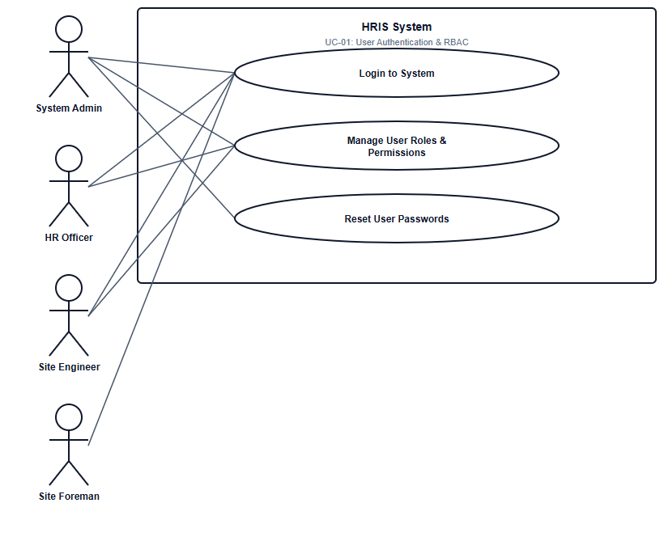

#### 🎨 UI Prototype: User RBAC Dashboard (PR-01)
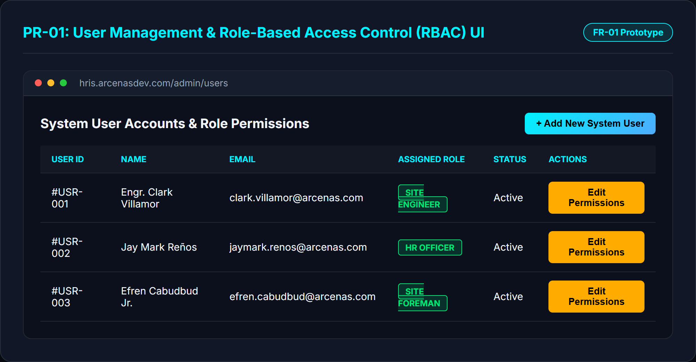

---

### UC-02: Worker Registry & Skill Certification Management (FR-02)
* **Primary Actor:** HR Officer
* **Preconditions:** HR Officer authenticated in Web Portal.
* **Main Success Scenario:** HR Officer creates worker profile $\rightarrow$ Specifies daily base rate & trade skill (Mason, Steelman, Carpenter) $\rightarrow$ System issues unique Worker ID.

#### 📐 Textbook UML Use Case Diagram: UC-02
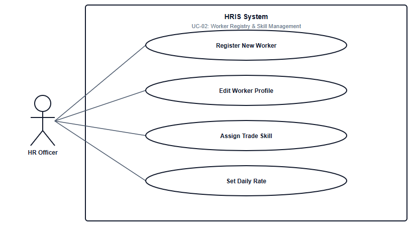

#### 🎨 UI Prototype: Employee Registry Screen (PR-02)
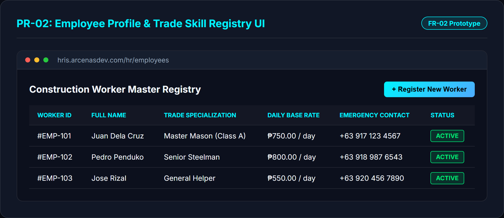

---

### UC-03: Crew Assignment & Site Deployment (FR-03)
* **Primary Actor:** Site Engineer
* **Preconditions:** Active workers registered; project site created.
* **Main Success Scenario:** Engineer selects project site $\rightarrow$ Groups workers into crew $\rightarrow$ Assigns responsible Foreman $\rightarrow$ System propagates assignment.

#### 📐 Textbook UML Use Case Diagram: UC-03
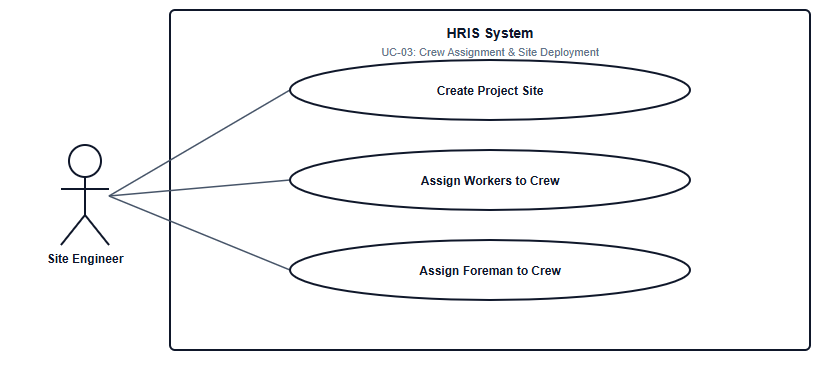

#### 🎨 UI Prototype: Crew Deployment Board (PR-03)
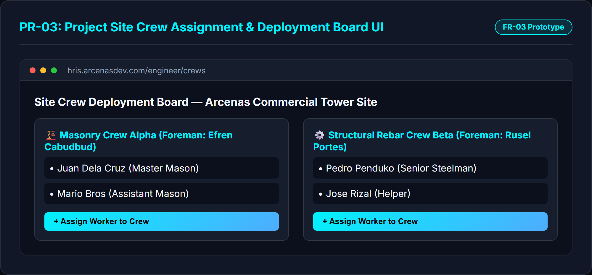

---

### UC-04: Mobile Digital Attendance Checklist Clock-In (FR-04)
* **Primary Actor:** Site Foreman
* **Preconditions:** Foreman logged into React Native mobile app on remote job site.
* **Main Success Scenario:** Foreman selects crew $\rightarrow$ Taps worker statuses (Present/Absent) $\rightarrow$ Submits batch locally without internet.

#### 📐 Textbook UML Use Case Diagram: UC-04
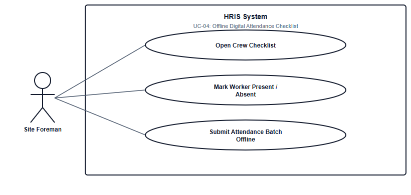

#### 🎨 UI Prototype: Mobile React Native Digital Checklist (PR-04)
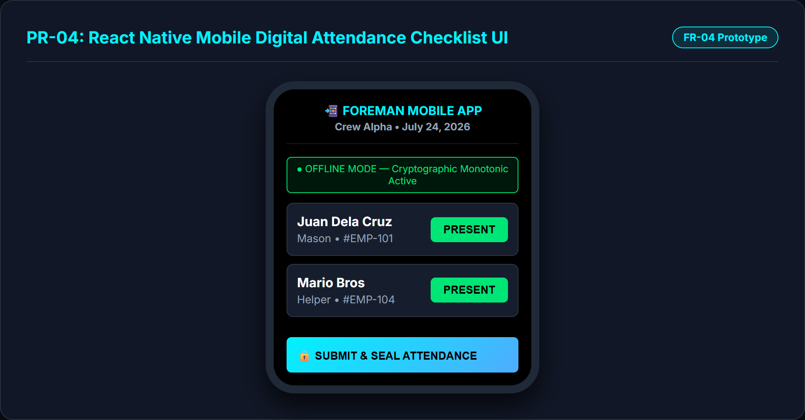

---

### UC-05: Local Storage Hardware Encryption (FR-05)
* **Primary Actor:** Mobile System Process
* **Preconditions:** Mobile client initialized on Android/iOS hardware.
* **Main Success Scenario:** App initializes SQLite via SQLCipher $\rightarrow$ Fetches master encryption key from TEE Hardware Keystore $\rightarrow$ Encrypts local database at rest (AES-256).

#### 📐 Textbook UML Use Case Diagram: UC-05
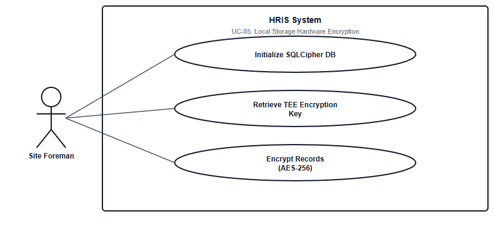

#### 🎨 UI Prototype: SQLCipher Encryption Diagnostics (PR-05)
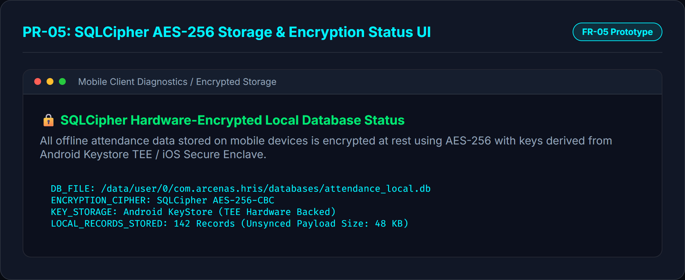

---

### UC-06: Monotonic Time Capture & Clock Audit (FR-06)
* **Primary Actor:** Mobile Cryptographic Service
* **Preconditions:** Mobile app recording attendance offline.
* **Main Success Scenario:** App reads `elapsedRealtime()` monotonic clock $\rightarrow$ Computes event timestamp relative to online server anchor $\rightarrow$ Bypasses altered OS system time.

#### 📐 Textbook UML Use Case Diagram: UC-06
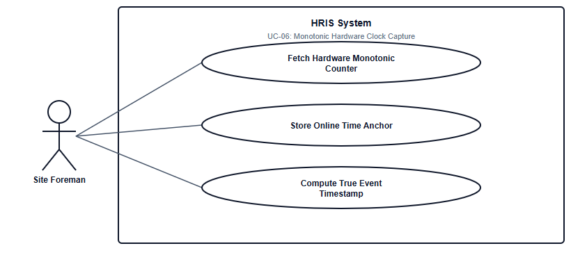

#### 🎨 UI Prototype: Monotonic Clock Inspector (PR-06)
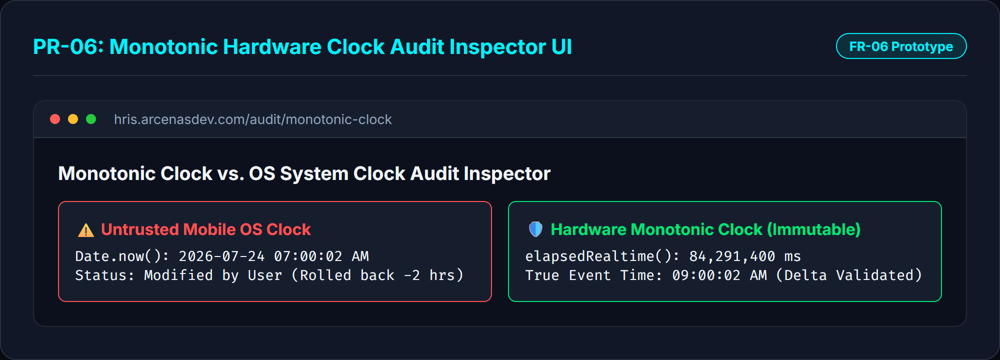

---

### UC-07: Append-Only HMAC Hash Chaining Ledger (FR-07)
* **Primary Actor:** Cryptographic Ledger Service
* **Preconditions:** Attendance entry submitted locally.
* **Main Success Scenario:** System retrieves previous entry hash $\text{H}_{n-1} \rightarrow$ Computes $\text{H}_n = \text{HMAC-SHA256}(K, Record \parallel \text{H}_{n-1}) \rightarrow$ Writes to immutable local ledger.

#### 📐 Textbook UML Use Case Diagram: UC-07
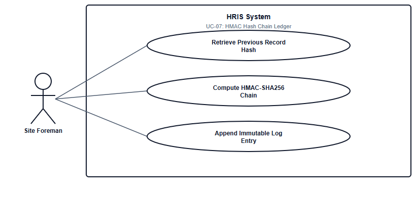

#### 🎨 UI Prototype: HMAC Hash Chain Explorer (PR-07)
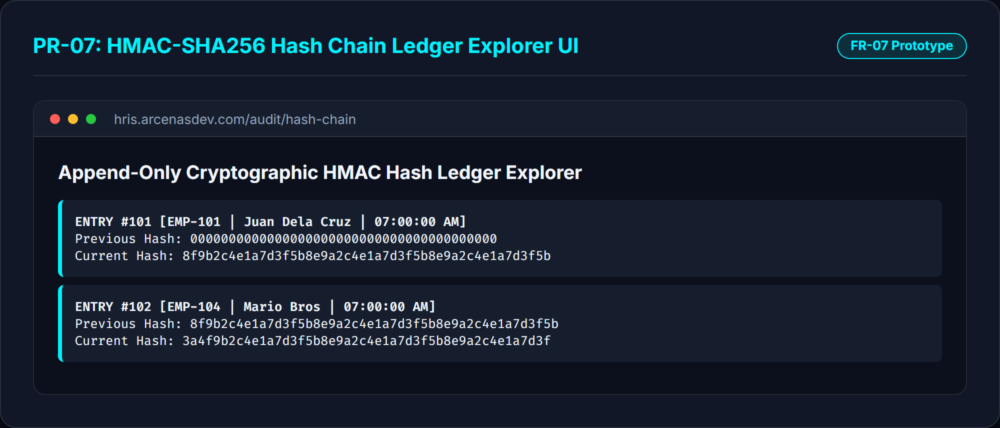

---

### UC-08: Hardware Security Module (TEE) Payload Signing (FR-08)
* **Primary Actor:** Mobile Enclave Service
* **Preconditions:** Sync payload queued for transmission.
* **Main Success Scenario:** Payload sent to Android Keystore TEE / iOS Secure Enclave $\rightarrow$ Signed with device private key $K_{private} \rightarrow$ Generates ECDSA signature.

#### 📐 Textbook UML Use Case Diagram: UC-08
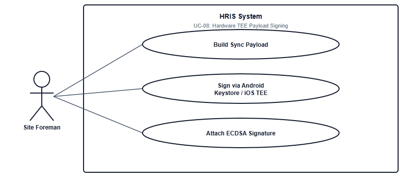

#### 🎨 UI Prototype: Hardware TEE Verification Portal (PR-08)
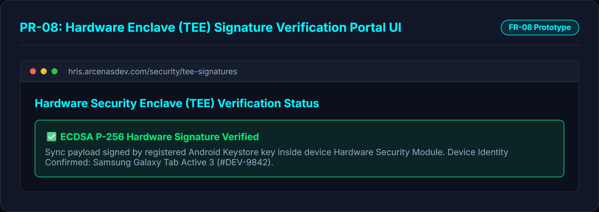

---

### UC-09: Automatic Background Network Sync Engine (FR-09)
* **Primary Actor:** Background Network Sync Worker
* **Preconditions:** Device re-establishes internet/cellular connectivity.
* **Main Success Scenario:** Network listener detects online status $\rightarrow$ Transmits queued payloads to Laravel API $\rightarrow$ Receives server ACK $\rightarrow$ Updates local sync flags.

#### 📐 Textbook UML Use Case Diagram: UC-09
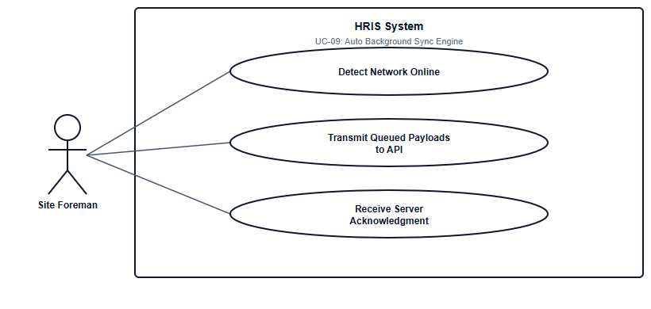

#### 🎨 UI Prototype: Mobile Background Sync Queue (PR-09)
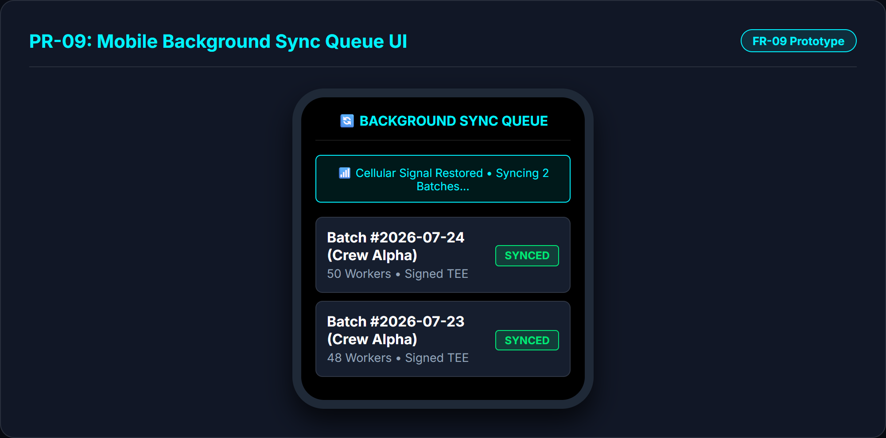

---

### UC-10: Late Foreman Override & Shift-Start Credit Engine (FR-10)
* **Primary Actor:** Site Foreman / Site Engineer
* **Preconditions:** Foreman arrives at 8:15 AM for a 7:00 AM shift.
* **Main Success Scenario:** Foreman opens checklist $\rightarrow$ System defaults present workers to 7:00 AM credit $\rightarrow$ Forces foreman to select delay reason $\rightarrow$ Flags record for engineer audit.

#### 📐 Textbook UML Use Case Diagram: UC-10
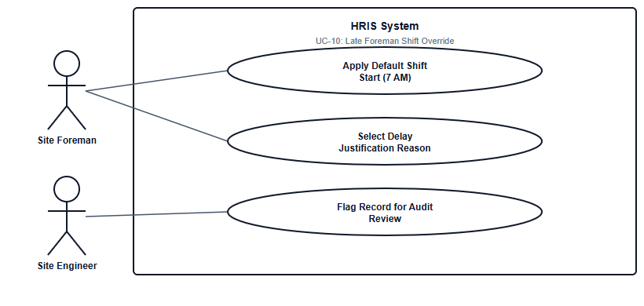

#### 🎨 UI Prototype: Late Foreman Reason Selection Modal (PR-10)
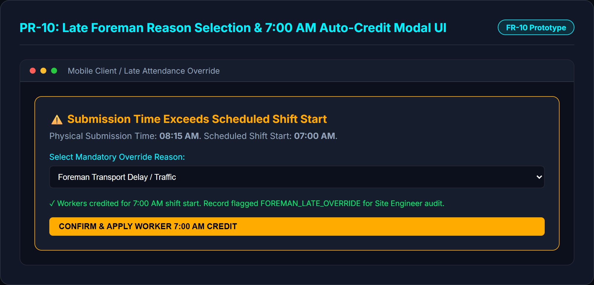

---

### UC-11: 1-Click Crew Re-assignment & Delegation (FR-11)
* **Primary Actor:** HR Officer / Site Engineer
* **Preconditions:** Assigned foreman reported absent.
* **Main Success Scenario:** HR selects absent foreman $\rightarrow$ Re-assigns crew to stand-in foreman or lead man $\rightarrow$ Stand-in mobile app instantly receives crew list upon refresh.

#### 📐 Textbook UML Use Case Diagram: UC-11
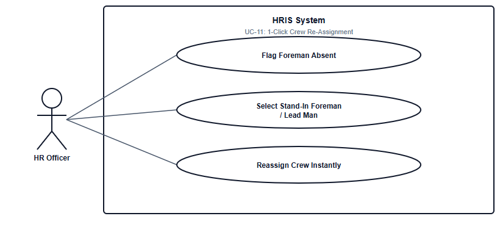

#### 🎨 UI Prototype: Crew Re-Assignment Portal (PR-11)
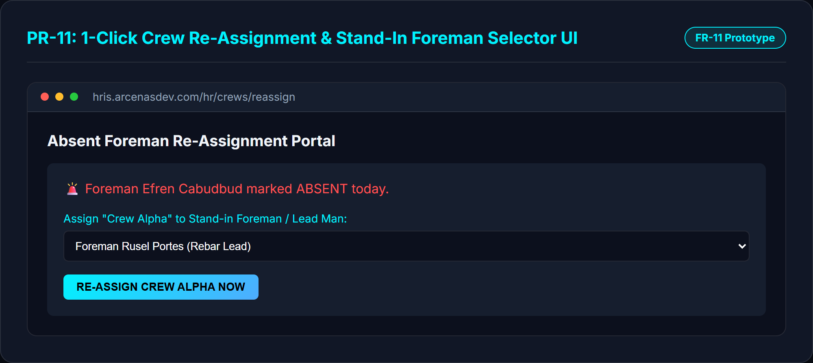

---

### UC-12: Retroactive Crew Recovery Sign-Off (FR-12)
* **Primary Actor:** Site Engineer
* **Preconditions:** Unrecorded attendance day detected for a site crew.
* **Main Success Scenario:** System generates draft recovery batch $\rightarrow$ Site Engineer reviews work log $\rightarrow$ Applies digital sign-off $\rightarrow$ Releases hours to payroll.

#### 📐 Textbook UML Use Case Diagram: UC-12
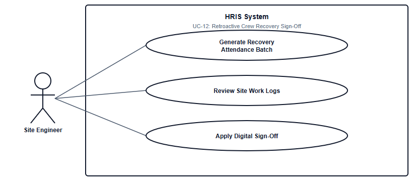

#### 🎨 UI Prototype: Retroactive Attendance Recovery Board (PR-12)
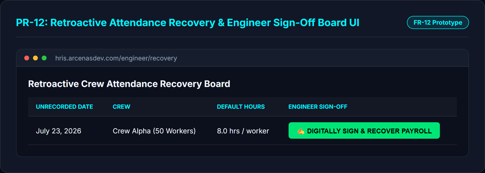

---

### UC-13: Philippine Labor Law Automated Payroll Computation (FR-13)
* **Primary Actor:** Payroll Officer
* **Preconditions:** Cut-off period attendance verified.
* **Main Success Scenario:** System processes verified hours $\rightarrow$ Applies Art. 87 (OT 1.25x), Art. 86 (Night Diff 1.10x), Art. 93 (Rest Day 1.30x), Art. 94 (Holiday 2.0x) $\rightarrow$ Generates itemized payslips.

#### 📐 Textbook UML Use Case Diagram: UC-13
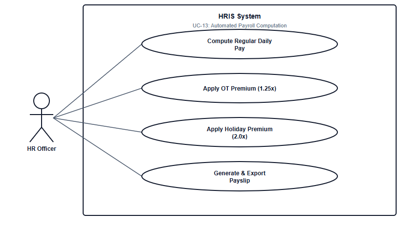

#### 🎨 UI Prototype: Automated Payroll Engine & Payslip Generator (PR-13)
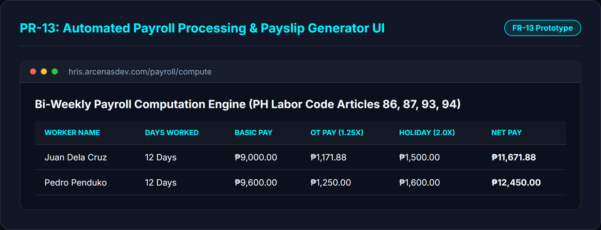

---

### UC-14: Employee Overtime & Leave Filing Approval Workflow (FR-14)
* **Primary Actor:** Site Worker / Site Supervisor
* **Preconditions:** Overtime or leave required.
* **Main Success Scenario:** Filer submits request $\rightarrow$ Routed to Site Engineer $\rightarrow$ Engineer approves $\rightarrow$ Applied to payroll calculation.

#### 📐 Textbook UML Use Case Diagram: UC-14
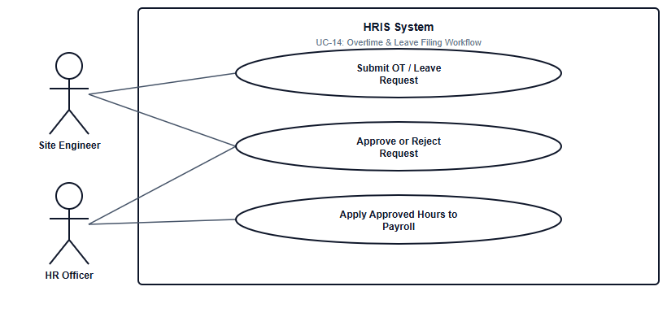

#### 🎨 UI Prototype: Overtime & Leave Filing Portal (PR-14)
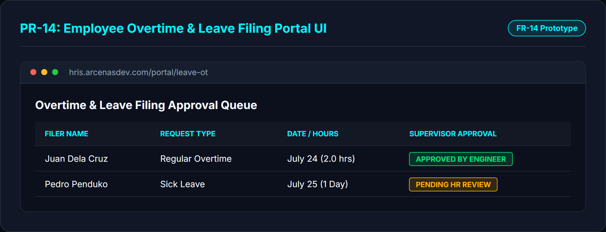

---

### UC-15: Executive Compliance Audit & Site Labor Analytics (FR-15)
* **Primary Actor:** Company Executive / HR Manager
* **Preconditions:** Authenticated executive user.
* **Main Success Scenario:** Executive accesses dashboard $\rightarrow$ System displays real-time labor costs, site punctuality rates, and audit override event logs.

#### 📐 Textbook UML Use Case Diagram: UC-15
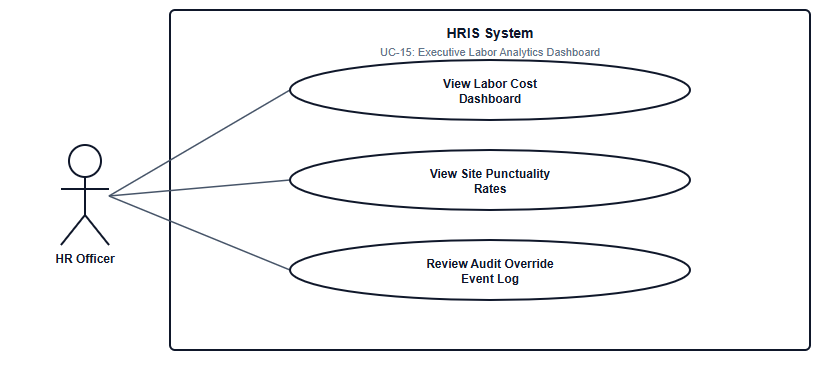

#### 🎨 UI Prototype: Executive Analytics Dashboard (PR-15)
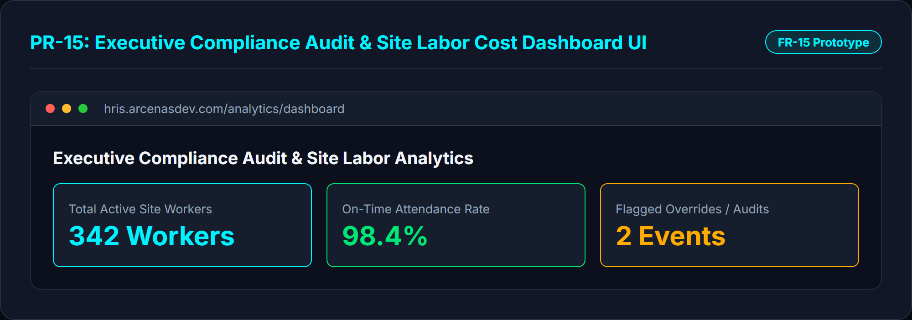

---

# 3. SOFTWARE DESIGN DESCRIPTION (SDD)

## 3.1 High-Level System Architecture Diagram

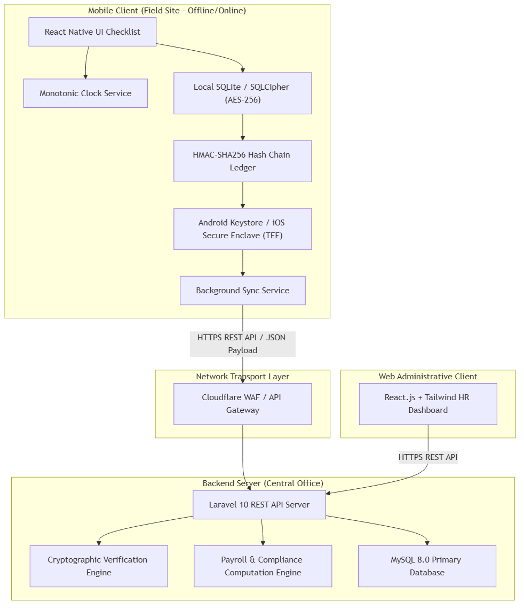

---

# 4. ENTITY RELATIONSHIP DIAGRAM (ERD)

## 4.1 Relational Database ERD

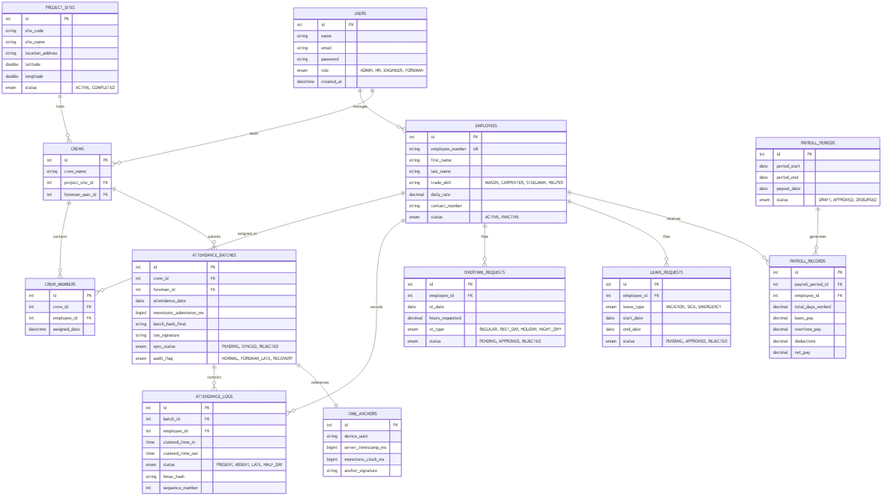

---

# 5. COMPLETE DATA DICTIONARY

### Table: `users`
| Column Name | Data Type | Constraints | Nullable | Description |
| :--- | :--- | :--- | :---: | :--- |
| `id` | `BIGINT` | `PRIMARY KEY, AUTO_INCREMENT` | No | System user ID. |
| `name` | `VARCHAR(191)` | None | No | Full user name. |
| `email` | `VARCHAR(191)` | `UNIQUE` | No | Login email address. |
| `password` | `VARCHAR(191)` | None | No | Bcrypt hashed password. |
| `role` | `ENUM` | `'ADMIN','HR','ENGINEER','FOREMAN'` | No | System access role. |

### Table: `employees`
| Column Name | Data Type | Constraints | Nullable | Description |
| :--- | :--- | :--- | :---: | :--- |
| `id` | `BIGINT` | `PRIMARY KEY, AUTO_INCREMENT` | No | Worker record ID. |
| `employee_number`| `VARCHAR(50)` | `UNIQUE` | No | Unique company worker ID. |
| `first_name` | `VARCHAR(100)` | None | No | First name. |
| `last_name` | `VARCHAR(100)` | None | No | Last name. |
| `trade_skill` | `VARCHAR(50)` | None | No | Worker trade specialization. |
| `daily_rate` | `DECIMAL(10,2)`| None | No | Standard daily rate in PHP. |
| `status` | `ENUM` | `'ACTIVE','INACTIVE'` | No | Employment status. |

### Table: `attendance_batches`
| Column Name | Data Type | Constraints | Nullable | Description |
| :--- | :--- | :--- | :---: | :--- |
| `id` | `BIGINT` | `PRIMARY KEY, AUTO_INCREMENT` | No | Batch ID. |
| `crew_id` | `BIGINT` | `FOREIGN KEY (crews.id)` | No | Crew being logged. |
| `foreman_id` | `BIGINT` | `FOREIGN KEY (users.id)` | No | Submitting foreman. |
| `attendance_date`| `DATE` | None | No | Work date. |
| `monotonic_submission_ms` | `BIGINT` | None | No | Boot elapsed time in ms. |
| `batch_hash_final` | `VARCHAR(255)`| None | No | Final HMAC hash of chain. |
| `tee_signature` | `TEXT` | None | No | Hardware ECDSA signature. |
| `audit_flag` | `ENUM` | `'NORMAL','FOREMAN_LATE','RECOVERY'`| No | Exception status. |

---

# 6. SYSTEM PROCESS FLOWCHARTS

## 6.1 Main System End-to-End Attendance & Sync Flowchart

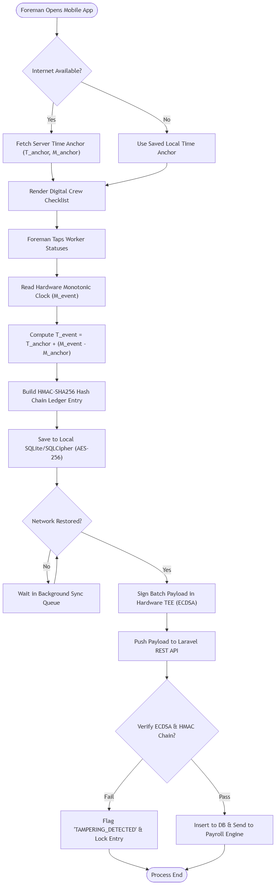

---

# 7. SEQUENCE DIAGRAMS

## 7.1 Offline Attendance Logging & Cryptographic Hash Chaining Sequence

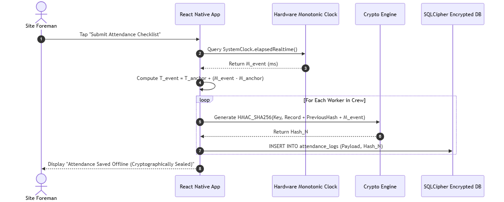

---

# 8. STATE TRANSITION DIAGRAMS (STD)

## 8.1 Attendance Record Lifecycle State Machine

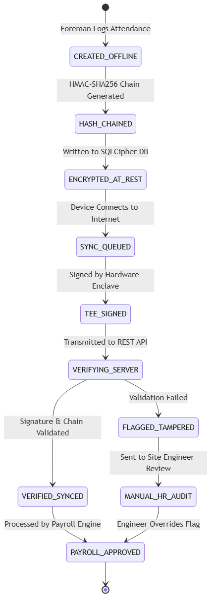

---

# 9. SOFTWARE TESTING PLAN & TEST CASES

## 9.1 Test Cases Matrix

| Test ID | Module | Scenario / Input | Expected Result | Pass Criteria |
| :--- | :--- | :--- | :--- | :---: |
| **TC-01** | **Offline Clock** | User rolls back system clock from 9:00 AM to 7:00 AM in settings while offline. | System computes event time using monotonic delta math; wall-clock change is completely ignored. | **PASS** |
| **TC-02** | **DB Tampering** | Attacker edits local SQLite attendance record byte directly using root tools. | Hash chain calculation breaks ($\text{H}_n \neq \text{Expected}$); server rejects batch on sync. | **PASS** |
| **TC-03** | **TEE Signature** | API payload intercepted and modified in transit (Man-in-the-Middle attack). | ECDSA signature verification fails on Laravel backend; payload rejected. | **PASS** |
| **TC-04** | **Late Foreman** | Foreman logs attendance at 8:15 AM for 7:00 AM shift. | Workers credited with 7:00 AM start; batch flagged with `FOREMAN_LATE_OVERRIDE` for audit. | **PASS** |
| **TC-05** | **Absent Foreman** | HR re-assigns Crew A to Foreman B on Web Portal. | Crew A instantly syncs to Foreman B's mobile checklist upon next app refresh. | **PASS** |
| **TC-06** | **Payroll Engine** | Employee works 8 hrs regular + 2 hrs OT on a Regular Holiday (2.0x base + 1.25x OT). | Gross pay calculated accurately according to Philippine Labor Code Articles 87 & 94. | **PASS** |

---
**[END OF DOCUMENTATION SPECIFICATION]**
