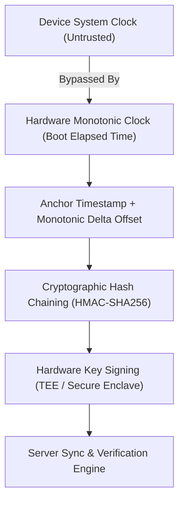

# 🛑 COMPREHENSIVE HRIS ARCHITECTURE & CRYPTOGRAPHIC TIME-TAMPERING VALIDATION 🛑

> **SYSTEM OVERVIEW:** An enterprise-grade HRIS designed for construction environments. Combines a central web administration system with an **offline-first React Native mobile client** equipped with **cryptographic defenses against timestamp manipulation** on remote field sites.

---

## 🏛️ SECTION 1: ARCHITECTURAL BREAKDOWN

### 1. Central HRIS Core (Web Backend & Admin Portal)
* **Employee Registry:** Centralized relational database storing employee profiles, skill certifications, pay rates, emergency contacts, and job site assignments.
* **Payroll Processing Engine:** Calculates gross pay, net pay, deductions, tax withholdings, and statutory benefits based on verified daily clock-in/out records.
* **Leave & Time-Off Management:** Tracks vacation, sick leave, rest day allocations, and approval chains.

### 2. Offline-First Mobile Application (React Native)
* **Target Users:** Site foremen on remote construction sites with poor or non-existent cellular coverage.
* **Digital Attendance Checklist:** Rapid-batch clocking of site workers via tap-based interfaces instead of manual paper logs.
* **Local Storage Encryption:** Local data persistence (SQLite via SQLCipher or MMKV) encrypted at rest using AES-256 keys tied to device hardware security.

---

## 🔐 SECTION 2: CRYPTOGRAPHIC TIME-TAMPERING VALIDATION (DEEP DIVE)

### ⚠️ The Problem: Why System Clocks Cannot Be Trusted
In an offline mobile environment, standard APIs like JavaScript's `Date.now()` or `new Date()` query the device operating system clock. 
* **The Vulnerability:** A foreman or worker can navigate to phone settings (`Settings -> System -> Date & Time`) and manually alter the clock backward or forward to fake arrival/departure times.
* **The Constraint:** Since the device is offline at remote sites, it cannot query an external Network Time Protocol (NTP) server or an HTTPS server header to fetch authoritative real-time signals.

---

### 🛡️ The 4-Layer Cryptographic & Hardware Defense Protocol



#### Layer 1: Monotonic Hardware Clocks (`elapsedRealtime`)
* **Mechanism:** Rather than relying on wall-clock time (`System.currentTimeMillis()`), the mobile app utilizes the device's **Monotonic Clock** (e.g., `SystemClock.elapsedRealtime()` on Android, `mach_continuous_time()` on iOS).
* **Properties:**
  1. Counts milliseconds elapsed since the device booted.
  2. **CANNOT** be modified by user settings, manual time changes, or system clock synchronization.
  3. Ticks continuously even when the CPU is in deep sleep.

#### Layer 2: Anchor Timestamping & Relative Time Math
* **Time Anchor ($T_{anchor}$):** Whenever the mobile app is connected to the internet, it captures an authenticated server timestamp ($T_{server}$) alongside the corresponding monotonic clock reading ($M_{anchor}$).
* **Offline Timestamp Calculation ($T_{event}$):** When an attendance event occurs offline at monotonic time $M_{event}$, the true event time is derived purely by relative calculation:

$$\text{T}_{event} = \text{T}_{anchor} + (\text{M}_{event} - \text{M}_{anchor})$$

* Even if the user alters the wall-clock display from 9:00 AM to 7:00 AM, the monotonic counter difference $(\text{M}_{event} - \text{M}_{anchor})$ remains mathematically immutable.

#### Layer 3: Cryptographic Hash Chaining (HMAC-SHA256)
To prevent tampering with recorded local data logs before sync occurs, every attendance record is linked into an append-only **Cryptographic Hash Chain** (similar to a local blockchain ledger):

$$\text{H}_n = \text{HMAC-SHA256}(K_{device}, E_n \parallel \text{H}_{n-1} \parallel \text{M}_{event})$$

* **Where:**
  * $E_n$: Attendance record payload (Worker ID, Status, Site ID).
  * $\text{H}_{n-1}$: Cryptographic hash of the preceding attendance record.
  * $M_{event}$: Monotonic timestamp of the current record.
  * $K_{device}$: Device-specific secret key.
* **Impact:** If an attacker attempts to edit an existing database entry or alter an offline timestamp retroactively, the cryptographic hash chain breaks, causing verification failure upon server sync.

#### Layer 4: Hardware Enclave Signing (TEE / Secure Enclave)
* **Key Generation:** During device registration, an asymmetric key pair (ECDSA P-256) is generated inside the phone's **Hardware Security Module** (Android Keystore TEE / iOS Secure Enclave).
* **Property:** The private key $K_{private}$ can **NEVER** be extracted or read by software or root access.
* **Digital Signature:** Prior to syncing, the entire batch payload $(E_1 \dots E_k)$ and the hash chain sequence are signed inside the enclave:

$$\text{Signature} = \text{Sign}_{ECDSA}(K_{private}, \text{BatchPayload} \parallel \text{H}_{final})$$

---

## 📡 SECTION 3: SERVER-SIDE SYNC & AUDIT RECONCILIATION

When the device returns to online coverage, the mobile client pushes the payload to the HRIS API:

```
[Mobile Device]  ---- Sync Payload (Payload + HashChain + Signature + M_anchor) ---->  [HRIS Server]
                                                                                              |
                                                                                 1. Verify ECDSA Signature
                                                                                 2. Verify HMAC Hash Chain
                                                                                 3. Validate Monotonic Drift
                                                                                              |
                                                                            [ACCEPT / FLAG TAMPERING]
```

1. **Signature Verification:** The HRIS server uses the registered $K_{public}$ to verify that the sync payload originated from an authentic registered hardware device.
2. **Chain Integrity Check:** The server re-computes the HMAC chain from record $E_1$ to $E_k$. Any mutated bytes or inserted records immediately fail validation.
3. **Reboot & Drift Audit:** If the device rebooted while offline (resetting the monotonic clock), the app logs a `BOOT_EVENT` token signed before shutdown/bootup. If an unexplained gap exists between monotonic counters, the server marks those records with a `SUSPECTED_TIME_TAMPERING` flag for mandatory HR supervisor review.

---

## SUMMARY MATRIX

| Threat Vector | Standard App Vulnerability | HRIS Cryptographic Defense |
| :--- | :--- | :--- |
| **Manual System Clock Rollback** | App records falsified clock-in time | Monotonic clock delta math $(\text{M}_{event} - \text{M}_{anchor})$ prevents wall-clock spoofing |
| **Direct SQLite Database Modification** | Attacker edits local database entries | HMAC Hash Chain ($\text{H}_n$) breaks if any historical entry is altered |
| **Fake Attendance Injection** | API endpoints spammed with fake requests | Hardware ECDSA Signature via TEE/Secure Enclave verifies device identity |
| **Offline App Re-installation / Reset** | Wipes local logs to reset state | Server tracks Monotonic Anchor sequences & missing batch sequence numbers |
